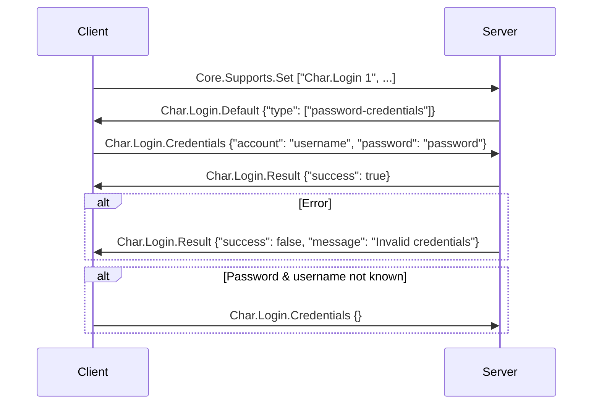

# The ``Char.Login`` package

Source: [Mudlet Wiki](https://wiki.mudlet.org/w/Standards:GMCP_Authentication)

This document defines a new GMCP extension to enable MUD clients to send credentials and perform authentication using GMCP messages instead of in-band login commands. It also includes optional support for OAuth authorization flows. 

## Rationale

Different MUDs have diverse login command formats, making it  challenging for MUD clients to handle login consistently. This extension provides a standardized way to exchange authentication information  through GMCP, simplifying client development and improving  compatibility. Additionally, the extension supports OAuth authorization  flows, allowing clients to leverage external identity providers for  login.

## Design

The extension introduces a new namespace called `Char.Login` with the following commands:

### Server-side

#### Char.Login.Default

Sent in response to `Client.Supports.Set`, or as soon as telnet negotiation completes, it informs the client of the supported authentication methods:
* `type` (array of strings, required): indicates the supported method(s), which is one or more of:
  - `password-credentials`: traditional username/password login.
  - `oauth`: OAuth-based login.
* `location` (string, required if `type` is `oauth`): openid-configuration location. See https://openid.net/specs/openid-connect-discovery-1_0.html

Since multiple flows can be supported by a server, the `type` array shall be ordered in the descending order of preference by the  server. For example, if the server supports only the credentials flow:

```
 Char.Login.Default {"type": ["password-credentials"]}
```

If the server supports both OAuth and credentials and prefers OAuth:

```
 Char.Login.Default {"type": ["oauth", "password-credentials"], "location": "https://example.com/.well-known/openid-configuration" }
```

#### Char.Login.Result

Sent in response to `Char.Login.Credentials`, it informs the client of the success or failure of the credentials-based login. 

- `success`: (boolean, required) Indicates whether the  authentication attempt was successful. Can be a string value for  compatibility with aged MUD drivers.
- `message`: (string, required if `success` is  false) required string if the login wasn't successful: a human-readable  message explaining the result, such as "Invalid credentials" or  "Character not found".

### Client-side

#### Char.Login.Credentials

After receiving `Char.Login.Default` with `type` as `password-credentials`, the client sends the character name and password for traditional login.

- `account` (string, required): character name or the  player account name. For games that implement both player and character  names, the character name can be included after a colon (:), for example `myaccount:mycharacter`.
- `password` (string, required): character password. Servers are encouraged to implement [TLS over telnet](https://wiki.mudlet.org/w/Manual:Supported_Protocols#Secure_connection_.28TLS.29) to allow secure transmission of passwords.

In case the client does not know both the character name and  password, it shall notify the server of this by sending an empty  response. This can be used a response to any authentication method:

```
Char.Login.Credentials {}
```


**Example Flow (Password Credentials):**

1. Client connects and sends: `Core.Supports.Set ["Char.Login 1", ...]`
2. Server responds with: `Char.Login.Default {"type": ["password-credentials"]}`
3. Client sends: `Char.Login.Credentials {"account": "username", "password": "password"}`
4. Server validates credentials and performs login.



Example password flow ([source](https://gist.github.com/vadi2/6fcc05500823122143a5d45c43915ff0))


 **OAuth Flows**

Specific details for the OAuth flow will be detailed once it is worked out with the community.

## Implementation Considerations

- This extension should be implemented according to the GMCP protocol specifications.
- Messages should be well-formatted JSON objects.
- Servers should validate incoming authentication information securely.
- Clients should handle potential errors and server responses gracefully.

## Conclusion

This GMCP extension provides a standardized and flexible approach to  MUD client authentication, improving compatibility and enabling support  for OAuth authorization flows. By adopting this extension, MUD  developers and client developers can simplify login processes and  enhance user experience.

**Note:** This is a draft proposal, and further community  input and refinement may be necessary before finalizing the  specification. Additionally, the specific details of OAuth flow support  require input from the community to be defined.
