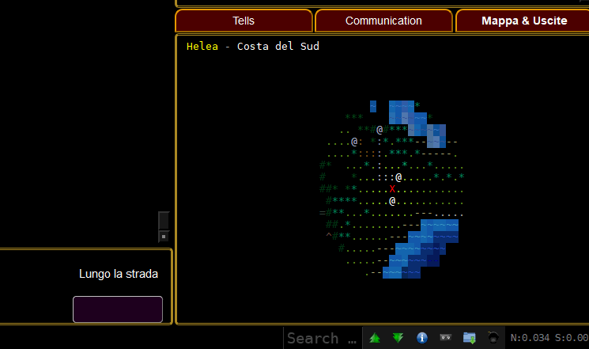

# The ``GMCP.Overland`` package

This package is supported in *Lumen et Umbra*s Mudlet package

## gmcp.overland.map

Sent by the server to update a colored ASCII map in the client. Only the rows that changed are sent.
````json
gmcp.overland.map {
    "r1" : "\033[38;2;0;0;0m     \033[38;2;111;94;84m...",
    "r2" : "..."
    ..
    "r11": "...",
    "size": 12
}
````
- **r1** to **r??**
  (*Mandatory*) Encoded ANSI control sequences and character data
- **size**
  (*Mandatory*) Number of rows of the full map
A control sequences indicator is encoded as "\033[". So "\033[38;2;111;94;84m" is the CSI sequence to set the foreground color as RGB value 111,94,84

### Representation in dedicated client frame
 