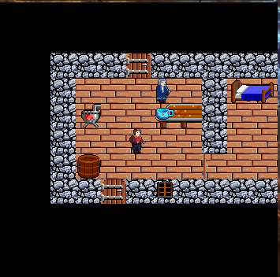

# The 'mudstandards.tilemap' package

The purpose of this package is to allow MU\* servers to control coordinate based maps. It is inspired from the `beip.tilemap` ([link](https://github.com/BeipDev/BeipMU/blob/master/TileMap.md)) package, but adds features to work with multiple tilesets per map, layering and options to choose tileset resolutions.

Example of an initial tileset definition command
```json
mudstandards.tilemap.tilesets {
    "mobs":{
        "url":"http://prelle.selfhost.eu:4080/symbols/Steam Arcana Mobs.png",
        "sizeX":32,
        "sizeY":32,
        "anim":{}
    },
    "assets":{
        "url":"http://prelle.selfhost.eu:4080/symbols/Steam Arcana Assets.png",
        "sizeX":32,
        "sizeY":32,
        "anim":{}
    },
    "immobiles":{
        "url":"http://prelle.selfhost.eu:4080/symbols/Steam Arcana Immobiles.png",
        "sizeX":32,
        "sizeY":32,
        "anim":{}
    },
    "terrain":{
        "url":"http://prelle.selfhost.eu:4080/symbols/Steam Arcana Terrain.png",
        "sizeX":32,
        "sizeY":32,
        "anim":{}
    }
}
```
The client can load all those tilesets, segment them according to the tile size and cache them for later use.

Sporadic (usually once per area change) definition how to map tile numbers to tilesets and the map dimensions.
```json
mudstandards.tilemap.info {
    "tileWidth":32,
    "tileHeight":32,
    "mapWidth":11,
    "mapHeight":11,
    "range":{
        "1":"terrain",
        "257":"immobiles",
        "513":"assets",
        "621":"mobs"
    }
}
```
Tiles from 1-256 are taken from the "terrain" tileset, tiles from 257-512 from the "immobiles" tileset, etc.
The map area is 11 tiles wide and 11 tiles high, each tile is 32x32 pixels - so the total map size is 352x352 pixels.

Example of a layered map:
```json
mudstandards.tilemap.update {
    "data":[
        [
            [],[],[],[],[],[],[],[],[],[],[]
        ],[
            [],[],[],[],[],[],[],[],[],[],[]
        ],[
            [],[],[119],[119],[119],[10,308],[119],[119],[119],[119],[119]
        ],[
            [],[],[119],[10],[10],[10],[10,641],[10],[119],[10,534],[10,535]
        ],[
            [],[],[119],[10,536],[10],[10],[10,539,556],[10,540],[119],[10],[10]
        ],[
            [],[],[119],[10],[10],[10,645],[10],[10],[119],[10],[10]
        ],[
            [],[],[119],[10,537],[10],[10],[10],[10],[10,311],[10],[10,639]
        ],[
            [],[],[119],[119],[10,308],[119],[119,306],[119],[119],[119],[119]
        ],[
            [],[],[],[],[],[],[],[],[],[],[]
        ],[
            [],[],[],[],[],[],[],[],[],[],[]
        ],[
            [],[],[],[],[],[],[],[],[],[],[]
        ]
    ]
}
```
An array of mapWidth x mapHeight (according to `mudstandards.tilemap.info`)) elements.
Each element has either none, one or multiple tile numbers. If ther are multiple tile numbers, they are drawn in the given order, so that the last tile number is on top.
For example `[10,539,556]` means that tile 10 is drawn first, then tile 539 on top of it and finally tile 556 on top of both. In the image below this is the floor tile from the terrain tileset, then the table from the assets tileset and finally the bowl from the immobiles tileset, above that the table and above the table the blue cup.


## Initial detection (TODO)

Query
Support   (graphic|ansi)

## mudstandards.tilemap.tilesets

With this command the server informs the client about all tilesets available and assigns identifiers to reference them in later commands. Tilesets may come in different resolutions - the client is free to pick the one suited best.

```json
mudstandards.tilemap.tilesets {
    "terrain": {
    	url: "http://.../SmallTiles.png",
        sizeX: 32,
        sizeY: 32,
        anim: {
        	"50": 4,
        	"54": 4
        }
    },
	"monster": {
        url: "https://...",
        sizeX: 32,
        sizeY: 32,
        anim: {
            "0": "4",
            "4": "4"
        }
    }
  }
}
```

Each tileset is named and the name is later used to reference it from other commands. Also tilesets may come with different tile sizes: 8, 16 or 32 - refererring to the width and height of a single tile.

- **size**  - Width x Height

- **url** - URL where to download the tileset

- **anim-frames** - Those tiles that are animated, are referenced by their number and have the number of animation frames assigned.

  > [!IMPORTANT]
  >
  > Tiles not listed in anim-frames are considered to consist of only 1 frame, meaning that they are not animated.
  >
  > A client not supporting animation can just ignore animation frames.


More to come
