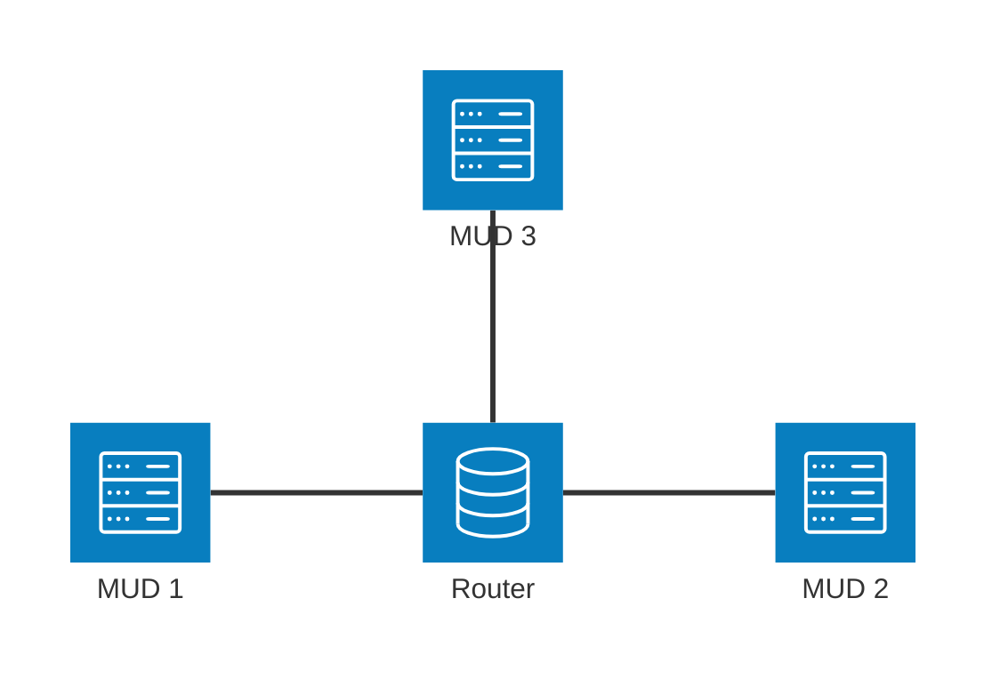
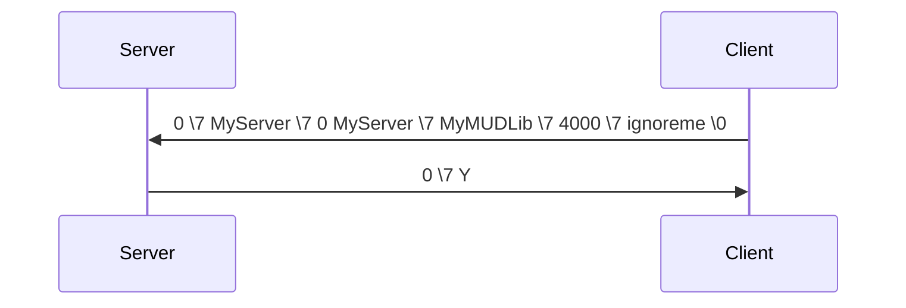
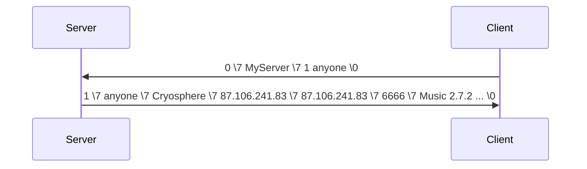

# AberChat

:::note
**Source 1**: [http://mud.stack.nl/intermud/aber.protocol.html](https://web.archive.org/web/20051217024309/http://mud.stack.nl/intermud/aber.protocol.html)
**Source 2**: [Fandom.com](https://muds.fandom.com/wiki/InterMUD#AberChat)
**Source 3**: [Aberchat client downloads](http://www.smile.ath.cx/downloads.html)

AberChat was a protocol exclusively used from AberMUDs to communicate with each other. 
In 2025 only one MUD (Cryosphere) is still connected to the network (and won't be for long anymore).
:::

## Architecture
AberChat uses TCP to connect to a central server. There was no mechanism to 
have a group of central routers for redundancy. 


### Central Server And Policy
Originally AberChat required that you registered via email with the admin of
the central server to get access to that server. In addition to that network
there was the idea of a more exclusive network where all servers in the exclusive
network got to vote if they wanted allow new members to join.

With more and more AberMUDs going offline that policy was dropped. The last 
remaining AberChat network operator (in 2025) is *Cryosphere* and the requirement
of a beforehand registration has been removed.

As of today the central server is ``Cryosphere.org``, Port ``6717``.

## Protocol on wire

* Messages are NULL terminated strings
* The ANSI Control Code \7 (BEL) was used as a separator between parameters
* There were two types of messages
  1. Messages targeted for a specific MUD
  2. Broadcast messages

Messages sent to a specific destination
```
0\7destination\7message-type\7argument1\7argument2...\0
```

A typical message to all muds looks like:
```
1\7message-type\7argument1\7argument2...\0
```

The `\7` character here is a special seperator (ASCII 7). This implies that this chacater is explicitly disallowed in the content of the arguments.

## Message Types
AberChat recognizes two types of messages, which are represented by a numerical value (0 or 1) at the very first position of a message.

### "0": Directed
These are messages that are directed to a specific MUD or to the central 
server. A second parameter is expected that describes the targeted MUD - 
or contain the sending MUD in case of messages sent to the central server.

### "1": Broadcast
These messages are directed to all MUDs. They are sent to the central server which forwards them to all connected MUDs-

## Command Types
After the message type (and eventually required target) the next parameter is 
the command type. This is represented as a single character.  
Features which are not present in the original implementation (like mail) are marked with [*].
:::warning
The command descriptions below do assume that add message type and eventually a target.
:::

### "0" authentication (Directed)
This is the first packet send out when connecting to the network. This allows 
the server to build a mudlist entry for the connected mud. 
**Only after a possitive reply (``0\7Y``), you will be able to send out other messages.**

| Pos | Parameter | Description |
| --- | --------- | ----------- |
|  1  |  mudname  | The name of the MUD (yes, this is also send in the message header).|
|  2  | mudlib-version | Whatever mudlib you are running. |
|  3  | portnumber | The port on which players can log in to the MUD.|
|  4  | password  | Your authentication password: this should be the same every time you attempt to connect. Note that passwords must be registred first.| 

**Example of an authentication process**


:::note
Originally mudname and password was used to verify against your registration credentials.
Since Cryosphere as a central server removed this verification, you still need to send
the password, but the content is ignored. 
:::

### "1" mudlist (Directed)
You can use this message to retreive a list of connected MUDs from the server. 
It is sent directed, but with the sending client MUD as a target name. You 
will get a response targeted to the sending player.

| Pos | Parameter | Description |
| --- | --------- | ----------- |
|  1  | fromplayer| The player who wishes to receive this list.| 

#### Response
| Pos | Parameter | Description |
| --- | --------- | ----------- |
|  1  |  mud[i] name  | The name of the MUD |
|  2  |  mud[i] host  | The hostname of the MUD or the IP address |
|  3  |  mud[i] ip    | The IP of the MUD |
|  3  |  mud[i] port  | The telnet port where players connect to |
|  3  |  mud[i] mudlib| MUDLib or version information |


**Requesting a MUD list**


### "2" echo
This message is only used for debugging purposes and it's not present in the original client distribution.

### "3" tell
Send a personal message directly to a player on another MUD.

| Pos | Parameter | Description |
| --- | --------- | ----------- |
|  1  | fromplayer| The player who sends the messages.|
|  2  | toplayer  | The person who is to receive this message. |
|  3  | frommud   | The originating MUD. |
|  4  |    text   | The message which is relayed. If the first character is a semicolon (":") then the message should be interpreted as an emote.| 

### "4" chat (Broadcast)
Send a message over the general chat channel. The other two channels are the god- and code-channel. This is one of the few packets which are directed to all other MUDs.

| Pos | Parameter | Description |
| --- | --------- | ----------- |
|  1  |  frommud  | The MUD sending this message into the world. |
|  1  | fromplayer | The player who has something important to say.
|  1  | text | The important message that this player has to say ;-) 

### "5" who request
Check which players are logged in on another MUD.

| Pos | Parameter | Description |
| --- | --------- | ----------- |
|  1  | frommud | The MUD sending this message into the world.
|  2  | fromplayer | The name of the curious player. 

### "6" who reply
The list of players that are logged on in a MUD. This packet is only send out in reply to a remote who request.
| Pos | Parameter | Description |
| --- | --------- | ----------- |
|  1  | toplayer  | The name of the curious player.|
|  2  |  frommud  | The name of the MUD on which the players listed below are logged in.|
|  3  |  player[i] name | The name of the i'th player who is logged in.
|  4  |  player[i] level | The level of this player (this is a human-readable string).|
|  5  |  player[i] title |  The title this player has selected or was assigned.|

The last three fields are repeated for each player that is logged on. If no player is present in the MUD, then these last tree fields are not even present at all in the packet. 

### "7" general info message (Broadcast)
This packet is used to send an important message to all MUDs on the network at once. Since the receiving MUDs may decide to show this message to all active players, this command is abuse-sensitive and should be restricted to admins (or players you trust).
| Pos | Parameter | Description |
| --- | --------- | ----------- |
|  1  | frommud   | The MUD sending this message into the world.
|  2  |   message | The message to relay to the rest of the universe. 

### "8" message
This packet is used for sending automatic messages which are not initiated by a user at the MUD that sends these out. This is mostly used for error messages. For example in reaction to a remote tell to a player which is not logged on.
| Pos | Parameter | Description |
| --- | --------- | ----------- |
|  1  | toplayer  | The player who is to receive this message.
|  2  | "MUD " mudname | The sender of this message. For MUDs this should always be the keyword "MUD" followed by the mudname.
|  1  | message   | The (error) message which is send out. For instance: ``"&*%s is marked as &+Ccoding &*and might not respond right away."`` 

### "9" kick
Ban a (remote!) player from the aberchat network. The correct implementation of this ban is left to the MUD that receives this message. If execution is not possible (e.g. "%s is to powerfull"), then an error message should be send using the previous packet.
| Pos | Parameter | Description |
| --- | --------- | ----------- |
|  1  | fromplayer | The player who wants to ban somebody else.
|  1  | toplayer | The victim who is to be banned.
|  1  | frommud | The name of the MUD from which the ban is issued. 

### ":" version reply
Send client version information to another player. This is usually send only in reply to a version request (discussed below).
| Pos | Parameter | Description |
| --- | --------- | ----------- |
|  1  |  toplayer | The player who is to be informed about the version used.
|  1  | version | The version of the aberchat client that is used. This is supposed to be a short human readable string. For instance: ``AberChat Client 4.20(pl 7)`` 

### ";" filepage
I still have to figure out what this is used for exactly.

### "&lt;" abergod
Send a message over the god's (wizards, creators) intermud channel. The arguments for this message are exactly the same as the chat channel (4).

### "=" abercode
Send a coding related over the god's (wizards, creators) intermud channel. The arguments for this message are exactly the same as the chat channel (4).

### ">" version request
Request version information from another MUD. This request is answered with a version reply packet as discussed above.
| Pos | Parameter | Description |
| --- | --------- | ----------- |
|  1  |   frommud | The MUD where the curious player lives.
|  2  | fromplayer | The player that is curious about the used aberchat version. 

### "?" abermail [*]
Send a MUD-mail message to a player on another MUD. This is acknowledged (denied) with a MUD message ("8").

| Pos | Parameter | Description |
| --- | --------- | ----------- |
|  1  | fromplayer| The person who sends this mail out. |
|  2  | frommud | The MUD from where this player is sending mail.
|  3  | toplayer | The recipient of the mail.
|  4  | subject | The subject of the mail (pretend this is email).
|  5  | date | The timestamp indicating when the mail was sent.
|  6  | data | The body of the mail: the message that is to be relayed. 

