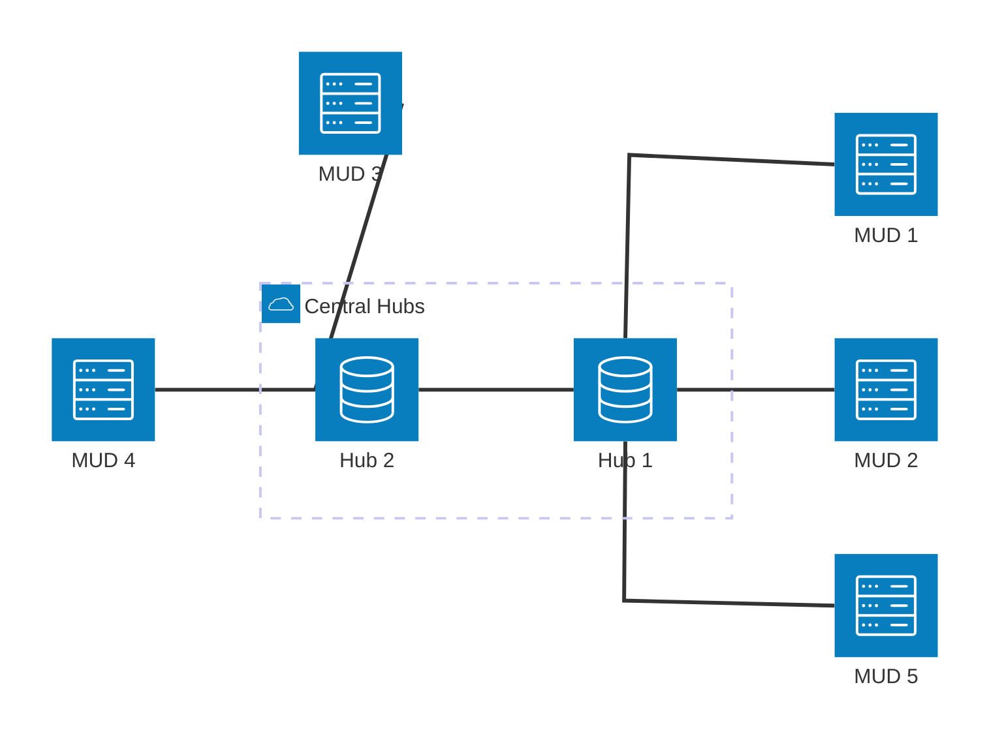

# Inter MUD Communications 2,  v0.10

:::note
**Source 1**: [http://www.mudbytes.net/imc2-intermud-protocol-documentation](https://web.archive.org/web/20080310185518/http://www.mudbytes.net/imc2-intermud-protocol-documentation)<br/>
**Source 2**: [https://www.circlemud.org/pub/CircleMUD/contrib/imc/imc2-circle3bpl15.tar.gz](https://www.circlemud.org/pub/CircleMUD/contrib/imc/imc2-circle3bpl15.tar.gz) <br/>
**Source 3**: [Gammon Forum](https://www.gammon.com.au/forum/?id=4080)
**Source 4**: [IMC 1 existed 1996](https://www.circlemud.org/maillist/1996-07/0721.html)

This protocol was used for Merc,Smaug,ROM codebases. It used a centralized router and TCP connections.
It was introduced in late 2004.
:::
## Summary
### Architecture
IMC2 is a protocol that requires one or more central routers that form a network. 
Each MUD connects via TCP to one of the central router to receive information about 
other servers and available channels.

MUD server only talk to *their* central router, which takes care of distributing
the message.

### Protocol on wire
Once the TCP connection is established, server and client exchange strings that 
must end with a newline. No information is given about character encoding, but 
UTF-8 likely isn't supported.
String parameters seem not to get quoted unless when they are identifiers 
(where spaces are not allowed).

Example messages
```
PW GraphicMUDIMC2 ClientPW version=1 autosetup ServerPW
PW *dalet ServerPW version=1.000000 LPMuds.net
*@WarofLegend 1752739928 dalet!*dalet is-alive *@GraphicMUDIMC2 versionid="WoL 10.29 (build: 37)" networkname="LPMuds.net" url="http://178.79.173.99" sha256=0 host="178.79.173.99" port=4200
ICE@*dalet 1752739919 *dalet ice-update *@GraphicMUDIMC2 channel=*dalet:gossip_nopolitcs owner=admin@Realm_of_Shadows operators=admin@Realm_of_Shadows policy=open excluded="a@b" level=Imm localname=gossip_nopolitcs
```
#### Changes to IMC1
There seems to be no existing documentation for version 1 of the IMC1 protocol 
anymore, but when reading the full spec below you notice places where 
parameter and commands have been declared *obsolete`.
This leads to the assumption that IMC1 was similiar and can be parsed by an
IMC2 parser.


### Channels
IMC2 supports having multiple channels and giving each channel a permission 
level and an administrator identified by an email address. New channels can 
be created on the fly, but unless acknowledged by a network administrator,
won't get announced.

In the past there have been network splits based upon policies by such 
network administrators.

### State in 2025
Only a single IMC2 network exists today and that only in the form of a central 
[Intermud3](intermud3) server that provides a IMC2 gateway. See [LPMuds.net](http://lpmuds.net/intermud.html) for details.

The server is ``97.107.133.86``, Port ``8888`` and is named ``Dalet``


------
Now follows the copy of the full [IMC2 spec](https://web.archive.org/web/20080310185518/http://www.mudbytes.net/imc2-intermud-protocol-documentation)


## What is IMC2?
IMC2 is a replacement for James Seng's IMC addon for Merc/Envy/ROM
based MUDs. It was written with three basic goals in mind:

*  to generate a completely new codebase, placed under the GPL
*  allow portability between mud types
*  a new protocol, circumventing various problems in the existing IMC code

## Features

*  supports rinfo, rwho, rtell, rreply, rbeep, imclist, rwhois, rquery,
   rfinger
*  ICE allows dynamic creation and removal of inter-mud channels, and
   allows control over who can participate in channels you own
*  inter-mud mail is now in (note to someone@anothermud)
*  core code is not tied to any particular mud flavour
*  loop elimination - IMC connections can form loops without causing echoing
*  code maintains a list of active muds on IMC plus ping times to them
*  backward compatibility - will connect to muds using James Seng's
   IMC code
*  forward compatibility - new packet types can be forwarded without
   recompiling
*  modularity - since the core code is mud-independent, the code is
   usable on just about anything, including no mud at all! (see
   router.c for an example of this)
*  ease of use - adding new packet types or modifying the behavior of
   existing types does not require an indepth knowledge of the protocol
*  easy configuration - imc.conf is human-readable, and all
   configuration can be done from within the mud without rebooting.
*  invisibility state (including wizi/incog) is preserved between muds
*  immortal commands: rconnect, rdisconnect, rignore, rsockets,
   imc (config editing)
*  colour between muds, independent of the particular method used by each

## General Packet Information
### Basic packet format (for all packets except connection packets)
```
<sender>;<origin> <sequence> <route>  <packet-type> <target>@<destination> <data...> 
```
Fields:
| Parameter | Description |
| --------- | ----------- | 
| sender    | The player/entity that sent the packet. * is a wildcard or 'global' entity. | 
| origin    | The MUD/Server/Place the packet originated from. | 
| sequence  | A long integer sent with the packets to help validate  the packet. The sequence is initialized by the client with the current  system time, and then one is added to it with every packet sent. | 
| route     | The list of MUDs and servers the packet has passed  through. This should always start with the originating MUD's name, and  should not have any other MUD names in it. All servers that routed the  packet are tacked on to the end, seperated by a !. <br/>Example: ``OrigMud!Hub1!Hub2`` 
| packet-type | This is a string that contains the type of packet. Example: "is-alive". | 
| target    | The player or entity the packet is intended for. |
| destination | The MUD the packet is intended to reach. | 
| data...   |   A range of data based on the **packet-type**  |

### Common origins/destinations
```
\*      This is the wildcard or 'broadcast' character. 
 $      This is the server-only or 'multicast' character. 
 IMC@$    Commonly used for ice-refresh packets. Sends to entity IMC2 on all servers. 
 ICE@<server> Mostly seen in channel replies from servers. 
 *@*     This will broadcast to all MUDs and servers. 
 *@$     This will multicast to all servers. 
 *@<mud>   Sends to a MUD without a specific target player. Useful for system messages. 
 *@<server>  Sends to a specific server without a target entity. 
```
### Packet Types
* keepalive-request 
* is-alive 
* ice-refresh 
* ice-update 
* ice-msg-r 
* ice-msg-b 
* ice-msg-p 
* user-cache 
* user-cache-request 
* user-cache-reply 
* tell 
* emote 
* remote-admin 
* ice-cmd 
* who 
* who-reply 
* ping 
* ping-reply 
* whois 
* whois-reply 
* beep 
* ice-chan-who 
* ice-chan-whoreply 
* ice-destroy 
* close-notify 
* imc-laston 
* channel-notify 
* reminfo-destroy 

### Notes about packet formats!
#### Special Characters

In most cases, data only needs to be enclosed in double quotes ' " '  when there is a space. However, all double quotes must be escaped with  the escape character ' \ '. This also means that the ' \ ' character  must also be escaped. Other characters that have to be escaped include  '\n' and '\r'. 

 Examples:
 ``` 
 " would become \" 
 \ would become \\ 
 \n would become \\n 
 \r would become \\r 
```
#### Socials and Emotes

Emotes are designated by an "emote=1" in the channel packet and refer to the message that should be displayed right after the Player@MUD's name. 

 Example: ichat ,grins. 
 Would be: Xorith@SOR-Live grins. 

 Socials are designated by an "emote=2" in the channel packet. The social text is to be compiled by the MUD before the packet is sent. 

 Example: ichat @grin Someone@MUD 
 Would be: Xorith@SOR-Live grins at Someone@MUD 

#### Ucache and Socials

The Ucache is kept locally by the MUD and used when compiling socials.  If a target of a social isn't in the MUD's local ucache, then the MUD  sends a user-cache-request packet before compiling the social. The  target MUD will then send a user-cache-reply packet containing the  information. The Ucache is intended to simply store the Name@MUD and  Gender of a remote player. A MUD automatically broadcasts a user-cache  packet when a new player can access IMC2, or when that player's gender  changes. 

### Color Codes and Translation

The network uses standardized color codes for sending color in packets  across the network. It is up to the client to make any translation from  local MUD color codes to the network color, and back again. 

 The current IMC2 Standard Color Codes are as follows: 
```
 Foreground: 
 ~Z Random   ~x Black    ~r Dark Red 
 ~g Dark Green ~y Orange    ~b Dark Blue 
 ~p Purple   ~c Cyan     ~w Grey 
 ~D Dark Grey  ~z (Same as ~D) ~R Red 
 ~G Green    ~Y Yellow    ~B Blue	 
 ~P Pink    ~C Light Blue  ~W White 

 Background: 
 ^Z Random   ^x Black  ^r Dark Red 
 ^g Dark Green ^O Orange ^B Dark Blue 
 ^p Purple   ^c Cyan  ^w Grey 
 ^z Dark Grey ^R Red   ^G Green 
 ^Y Yellow   ^b Blue  ^P Pink 
 ^C Light Blue ^W White 

 Blinking Foreground: 
 `Z Random   `x Black `r Dark Red 
 `g Dark Green `O Orange `b Dark Blue 
 `p Purple   `c Cyan  `w Grey 
 `z Dark Grey  `R Red  `G Green 
 `Y Yellow   `B Blue  `P Purple 
 `C Light Blue `W White 

 Misc: 
 ~! Reset    ~L Bold  ~u Underline 
 ~$ Blink    ~i Italic ~v Reverse 
 ~s Strike-thru 

 For Backwards Compatability: 
 ~m = ~p 
 ~d = ~w 
 ~M = ~P 
```


## Connection and Authentication Packets
### Plain Text
```
CLIENT Sends: PW <mudname> <clientpw> version=<version#> autosetup <serverpw> (SHA256) 

 On initial client connection: 
 SERVER Sends: autosetup <servername> accept <networkname> (SHA256-SET) 

 On all subsequent non-SHA256 client connections: 
 SERVER Sends: PW <servername> <serverpw> version=<version#> <networkname> 
```

### SHA-256
```
CLIENT Sends: SHA256-AUTH-REQ &lt;mudname&gt; 
 SERVER Sends: SHA256-AUTH-INIT &lt;servername&gt; &lt;key&gt; 
 CLIENT Sends: SHA256-AUTH-RESP &lt;mudname&gt; &lt;hash&gt; version=&lt;version#&gt; 
 SERVER Sends: SHA256-AUTH-APPR &lt;servername&gt; &lt;networkname&gt; version=&lt;version#&gt; 
```
 Fields: 
 ```
 PW       The literal string: PW 
 autosetup   The literal string: autosetup 
 &lt;mudname&gt;   Name of the MUD or client connecting. 
 &lt;servername&gt;  Name of the server the client is connecting to. 
 &lt;clientpw&gt;   This is the client password saved in the client's configuration. 
 &lt;serverpw&gt;   This is the server password saved in the client's configuration. 
 &lt;version#&gt;   This is the protocol version number. In most cases, this will be the number 2. 
 &lt;networkname&gt; This is the name of the network the server is connected to. 
 &lt;key&gt;     This is a long integer sent by the server. It is used in creating the &lt;hash&gt; 
 &lt;hash&gt;     This is the result of the &lt;key&gt;+&lt;clientpw&gt;+&lt;serverpw&gt;. 
```

 Optional Arguments( required if using the specified authentication method ): 

 (SHA256)   The literal string: SHA256. This is sent to notify the  server that the MUD is SHA256-Enabled. All future logins from this  client will be expected in SHA256-AUTH format if the server supports it. 

 (SHA256-SET) The literal string: SHA256-SET. This is sent by the server  to notify the client that it will now expect SHA256 authentication from  the client from now on. The client should make itself aware of this for  future connections. 

 If a client sends more than one type of authentication for whatever  reason, the login should be rejected. A properly configured client  should then respond by trying to authenticate in plain text. 


## Packet Definitions
### keepalive-request

#### Description:
This packet is sent by a MUD to trigger is-alive packets from other MUDs. 
This packet is usually followed by the sending MUD's own is-alive packet. 
It is used in the filling of a client's MUD list, thus any MUD that  doesn't respond with an is-alive isn't marked as online on the sending  MUD's mudlist. 

#### Data: 
    (none) 

#### Older client Data: 
```
versionid=&lt;string&gt;  Where *string* is the text version ID of the client. ("IMC2 4.5 MUD-Net")
``` 

:::note
This is no longer sent with a keepalive-request, however older clients may still send it. 
:::

##### Example of a received keepalive-request: 
``` 
***@YourMUD 1234567890 YourMUD!Hub1 keepalive-request \*@\***
``` 

#### Example of a sent keepalive-request: 
``` 
***@YourMUD 1234567890 YourMUD keepalive-request \*@\***
``` 


### is-alive

#### Description: 
 This packet is the reply to a keepalive-request packet. It is  responsible for filling a client's mudlist with the information about  other MUDs on the network. 

#### Data:
| Parameter | Type   | Description |
| --------- | ------ | ----------- | 
| versionid | string | Text version ID of the client. ("IMC2 4.5 MUD-Net") |
|      url  | string | The proper URL of the client. (http://www.domain.com)| 
|      host | string | The telnet address of the MUD. (telnet://domain.com) |
|      port |   int  | The telnet port of the MUD. | 


 (These data fields are not sent by the MUD, they are added by the server.) 
 networkname=&lt;string&gt; Where &lt;string&gt; is the network name that the MUD/server is on. ("MyNetwork") 
 sha256=&lt;int&gt;     This is an optional tag that denotes the SHA-256 capabilities of a MUD or server. 

##### Example of a received is-alive:
```
*@SomeMUD   1234567890 SomeMUD!Hub2 is-alive *@YourMUD        versionid="IMC2 4.5 MUD-Net"  networkname="MyNetwork"  url="http://www.domain.com" sha256=1  host=domain.com     port=5500
*@CoffeeMud 1752738500 dalet!*dalet is-alive *@GraphicMUDIMC2 versionid="CoffeeMud v5.10.5" networkname="LPMuds.net" url="http://99.88.247.49"   sha256=0  host="99.88.247.49" port=2323 
```
##### Example of a sent is-alive: 
``` 
*@YourMUD 1234567890 YourMUD is-alive *@* versionid="IMC2 4.5 MUD-Net" url="http://www.domain.com" host=domain.com port=5500 
``` 


### ice-refresh

#### Description: 
 This packet is sent by the MUD to request data about the channels on the network. Servers with channels reply with an ice-update packet for each channel they control. The usual target for this packet is IMC@$. 

#### Data: 
 (none) 

#### Example: 
``` 
*@YourMUD 1234567890 YourMUD!Hub1 ice-refresh IMC@$ 
``` 


### ice-update

#### Description: 
A server returns this packet with the data of a channel when prompted with an ice-refresh request. 

#### Data: 
| Parameter | Type   | Description |
| --------- | ------ | ----------- | 
| channel | string |  The channel's network name in the format of ServerName:ChannelName 
| owner | string |   The Name@MUD of the channel's owner 
| operators | string | A space-seperated list of the Channel's operators, in the format of Person@MUD 
| policy | string |   The policy is either "open" or "private" with no quotes. 
| invited | string |  The space-seperated list of invited User@MUDs, only valid for a "private" channel. 
| excluded | string |  The space-seperated list of banned User@MUDs, only valid for "open" channels. 
| level | string |   The default level of the channel: Admin, Imp, Imm, Mort, or None 
| localname | string | The suggested local name of the channel. 

#### Examples: 

##### Open Policy: 
``` 
ICE@Hub1   1234567890 Hub1!Hub2 ice-update *@YourMUD        channel=Hub1:ichat         owner=Imm@SomeMUD      operators=Other@SomeMUD    policy=open excluded="Flamer@badMUD Jerk@dirtyMUD" level=Imm localname=ichat
ICE@*dalet 1752739919 *dalet    ice-update *@GraphicMUDIMC2 channel=*dalet:roleplaying owner=admin@Dragonfire operators=admin@Dragonfire policy=open excluded="a@b"                   level=Imm localname=roleplaying 
``` 

##### Private Policy: 
``` 
ICE@Hub1 1234567890 Hub1!Hub2 ice-update *@YourMUD  channel=Hub1:secretchat owner=Imm@SomeMUD operators=Other@SomeMUD  policy=private invited="SpecialDude@OtherMUD CoolDude@WeirdMUD"  level=Mort localname=schat 
``` 


### ice-msg-r

Description: 
 The -r in this ice-msg packet means it was relayed. This, along with the ice-msg-p packet, are used with private policy channels. The 'r' stands for 'relay'. All incoming channel messages are from ICE@&lt;server&gt;, where &lt;server&gt; is the server hosting the channel. 

 Data: 
| Parameter | Type   | Description |
| --------- | ------ | ----------- | 
| realfrom | string | The User@MUD the message came from. 
| channel | string | The Server:Channel the message is intended to be displayed on. 
| text | string |   The message text. 
| emote | int |    An integer value designating emotes. 0 for no emote, 1 for an emote, and 2 for a social. 

 Examples: 
``` 
ICE@Hub1 1234567890 Hub1!Hub2 ice-msg-r *@YourMUD realfrom=You@YourMUD channel=hub1:secret text="Aha! I got it!" emote=0 

ICE@Hub1 1234567890 Hub1!Hub2 ice-msg-r *@YourMUD realfrom=You@YourMUD channel=hub1:secret text=Ahh emote=0 

ICE@Hub1 1234567890 Hub1!Hub2 ice-msg-r *@YourMUD realfrom=You@YourMUD channel=hub1:secret text="grins evilly." emote=1 

ICE@Hub1 1234567890 Hub1!Hub2 ice-msg-r *@YourMUD realfrom=You@YourMUD  channel=hub1:secret text="You@YourMUD grins evilly!" emote=2 
``` 


### ice-msg-p

Description: 
 This packet is sent when a player sends a message to a private channel.  This packet should never be seen as incoming to a client. The target of  this packet should be IMC@&lt;server&gt; of the server hosting the  channel. 

 Data: 
| Parameter | Type   | Description |
| --------- | ------ | ----------- | 
| channel | string | The Server:Channel the message is intended to be displayed on. 
| text | string |   The message text. 
| emote | int |    An integer value designating emotes. 0 for no emote, 1 for an emote, and 2 for a social. 
| echo | int |    Tells the server to echo the message back to the sending MUD. This is only seen on out-going messages. 

Examples: 
``` 
You@YourMUD 1234567890 YourMUD ice-msg-p IMC@Hub1 channel=Hub1:secret text="Ahh! I got it!" emote=0 echo=1 
You@YourMUD 1234567890 YourMUD ice-msg-p IMC@Hub1 channel=Hub1:secret text=Ahh! emote=0 echo=1 
You@YourMUD 1234567890 YourMUD ice-msg-p IMC@Hub1 channel=Hub1:secret text="grins evilly." emote=1 echo=1 
You@YourMUD 1234567890 YourMUD ice-msg-p IMC@Hub1 channel=Hub1:secret text="You@YourMUD grins evilly." emote=2 echo=1 
``` 


### ice-msg-b

Description: 
 This is the packet used to chat on open policy channels. When sent from a MUD, it is broadcasted across the network. Other MUDs receive it  in-tact as it was sent by the originating MUD. The server that hosts the channel sends the packet back to the originating MUD as an 'echo' by  removing the "echo=1" and attaching the "sender=Person@MUD" data field. 

 Data: 
| Parameter | Type   | Description |
| --------- | ------ | ----------- | 
| channel   | string |  The Server:Channel the message is intended to be displayed on. 
| text    | string |   The message text. 
| emote   | int |    An integer value designating emotes. 0 for no emote, 1 for an emote, and 2 for a social. 
| *echo   | int |    This stays on broadcasted messages. It tells the channel's server to relay an echo back. 
| *sender | string |  The hosting server replaces "echo=1" with this when sending the echo back to the originating MUD. 

 Examples: (See above for emote/social examples as they are pretty much the same) 

 Return Echo Packet: 
``` 
You-YourMUD@Hub1 1234567890 Hub1 ice-msg-b *@YourMUD text=Hi! channel=Hub1:ichat sender=You@YourMUD emote=0 
``` 

Broadcasted Packet: 
``` 
You@YourMUD 1234567890 YourMUD!Hub1 ice-msg-b *@* channel=Hub1:ichat text=Hi! emote=0 echo=1 
``` 


### user-cache

Description: 
 Sent by a MUD with a new IMC2-able player or when a player's gender  changes, this packet contains only the gender for data. The packet's  origination should be the Player@MUD. 

 Data: 
| Parameter | Type   | Description |
| --------- | ------ | ----------- | 
| gender | int |  0 is male, 1 is female, 2 is anything else such as neuter. Will be referred to as "it". 

 Example: 
``` 
Dude@someMUD 1234567890 SomeMUD!Hub2!Hub1 user-cache *@* gender=0 
``` 


### user-cache-request

Description: 
 The MUD sends this packet out when making a request for the user-cache  information of the user included in the data part of the packet. 

 Data: 
| Parameter | Type   | Description |
| --------- | ------ | ----------- | 
| user | string |  The Person@MUD whose data the MUD is seeking. 

Example: 
``` 
*@YourMUD 1234567890 YourMUD user-cache-request *@SomeMUD user=Dude@SomeMUD 
``` 


### user-cache-reply

Description: 
 A reply to the user-cache-request packet. It contains the user and gender for the user. 

 Data: 
| Parameter | Type   | Description |
| --------- | ------ | ----------- | 
| user | string |  The Person@MUD whose data the MUD requested. 
| gender | int |  The gender of the Person@MUD in the 'user' field. 

Example: 
``` 
*@someMUD 1234567890 SomeMUD!Hub2!Hub1 user-cache-reply *@YourMUD user=Dude@SomeMUD gender=0 
``` 


### tell

#### Description: 
 This packet is used to communicate private messages between users on MUDs across the network. 

#### Data: 
| Parameter | Type   | Description |
| --------- | ------ | ----------- | 
| text | string |  Message text 
| isreply | int |  Two settings: 1 denotes a reply, 2 denotes a tell social. 

#### Example: 
Originating: 
``` 
You@YourMUD 1234567890 YourMUD tell Dude@SomeMUD text="Having fun?" 
``` 

Reply from Dude: 
``` 
Dude@SomeMUD 1234567890 SomeMUD!Hub1 tell You@YourMUD text="Yeah, this is cool!" isreply=1 
``` 


### emote
#### Description: 
 This packet seems to be sent by servers when notifying the network of a new channel or the destruction of a channel. 

#### Data: 
| Parameter | Type   | Description |
| --------- | ------ | ----------- | 
| channel | int |  Unsure of what this means. The channel seen in both creation and destruction packets is 15. 
| level | int |   I am assuming this is the permission level of the  sender. In both creation and destruction messages, this is -1. 
| text | string |  This is the message to be sent to the users. 

Examples:
``` 
ICE@Hub1 1234567890 Hub1 emote *@* channel=15 level=-1 text="the channel called hub1:test has been destroyed by You@YourMUD." 
```


### remote-admin

Description: 
 This packet is used in remote server administration. Please note that  SHA-256 Support is *required* for a client to use this feature. The  command can vary, in fact this very packet is highly dependant on the  server it's being directed to. In most cases, sending the 'list' command will have a remote-admin enabled server send you the list of commands  it will accept.  

 Data: 
| Parameter | Type   | Description |
| --------- | ------ | ----------- | 
| command | string |  The command being sent to the server for processing. 
| data | string |   Data associated with the command. This is not always required. 
| hash | string |   The SHA-256 hash that is verified by the  server. This hash is generated in the same manner as an authentication  packet. 

 Example: 
``` 
You@YourMUD 1234567890 YourMUD remote-admin IMC@Hub1 command=list hash=&lt;hash goes here&gt; 
``` 


### ice-cmd

Description: 
 Used for remote channel administration. In most cases, one must be  listed as a channel creator on the target server in order to do much  with this packet. Other cases include channel operators. 

 Data: 
| Parameter | Type   | Description |
| --------- | ------ | ----------- | 
| channel | string | The target server:channel for the command. 
| command | string | The command to be processed. 
| data | string |   Data associated with the command. This is not always required. 

 Example: 
``` 
You@YourMUD 1234567890 YourMUD ice-cmd IMC@hub1 channel=hub1:ichat command=list 
``` 


### ice-destroy

Description: 
 Sent by a server to indicate the destruction of a channel it hosted. The mud should remove this channel from its local configuration. 

 Data: 
| Parameter | Type   | Description |
| --------- | ------ | ----------- | 
| channel | string |  The server:channel being destroyed. 


### who

Variant: wHo ( obsolete ) 

 Description: 
 A seemingly mutli-purpose information-requesting packet. The istats  packet currently only works on servers, or at least that's the case on  MUD-Net servers. The 'finger' type takes a player name in addition to  the type name. 

 Example: "finger Dude". The 'who' and 'info' types take no argument. The MUD is responsible for building the reply text sent in the who-reply  packet. 

 Data: 
| Parameter | Type   | Description |
| --------- | ------ | ----------- | 
| type | string |  Types: who, info, "finger &lt;name&gt;", istats (server only) 

 Example: 
``` 
Dude@SomeMUD 1234567890 SomeMUD!Hub1 who *@YourMUD type=who 
``` 


### who-reply

Description: 
 The multi-purpose reply to the multi-purpose information-requesting  'who' packet. The MUD is responsible for building the return data,  including the format of it. The mud can use the permission level sent in the original who packet to filter the output. The example below is the  MUD-Net format. 

 Data: 
| Parameter | Type   | Description |
| --------- | ------ | ----------- | 
| text | string |  The formatted reply to a 'who' packet. 

 Additional Notes: 
 The example below is for the who list packet. The same construction would go into formatting the other types of who packets. 

 Example: 
``` 
*@YourMUD 1234567890 YourMUD who-reply Dude@SomeMUD text="\n\r            ~R-=&lt; ~WPlayers on YourMUD ~R&gt;=-\n\r        ~Y-=&lt; ~Wtelnet://yourmud.domain.com:1234  ~Y&gt;=-\n\r\n\r~B--------------------------------=&lt; ~WPlayers  ~B&gt;=---------------------------------\n\r\n\r    ~BPlayer     ~z&lt;---&gt;~G Mortal the  Toy\n\r\n\r~R-------------------------------=&lt; ~WImmortals  ~R&gt;=--------------------------------\n\r\n\r    ~YStaff      ~z&lt;---&gt;~G You the Immortal\n\r\n\r~Y&lt;~W2 Players~Y&gt;  ~Y&lt;~WHomepage: [http://www.yourmud.com~Y&gt;](https://web.archive.org/web/20080310185518/http://www.yourmud.com~y&gt;/) &lt;~W 2 Max Since Reboot~Y&gt;\n\r~Y&lt;~W3 logins since last reboot on Tue Feb 24, 2004 6:55:59 PM EST~Y&gt;" 
```


### ping

**Obsolete** Will most likely not get a response. 

 Description: 
 Requests the destination MUD to return its path. 

 Data: 
 (None) 

 Example: 
``` 
*@YourMUD 1234567890 YourMUD ping *@SomeMUD 
``` 


### ping-reply

**Obsolete** Will most likely never be seen. 

 Description: 
 The reply to a ping packet. The path should be the route the ping packet traveled to the destination. 

 Data: 
| Parameter | Type   | Description |
| --------- | ------ | ----------- | 
| path | string |  The route of the original ping packet. 

 Example: 
``` 
*@SomeMUD 123467890 SomeMUD!Hub1 ping-reply *@SomeMUD path=YourMUD!Hub1 
``` 


### whois

Description: 
 Sends a request to the network for the location of the specified player. 

 Data: 
| Parameter | Type   | Description |
| --------- | ------ | ----------- | 
| level | int |  The permission level of the person making the request. 

 Example: 
``` 
You@YourMUD 1234567890 YourMUD whois dude@* level=5 
``` 


### whois-reply

Description: 
 The reply to a whois packet. The MUD is responsible for building and  formatting the text sent back to the requesting player, and can use the  permission level sent in the original whois packet to filter or block  the response. 

 Data: 
| Parameter | Type   | Description |
| --------- | ------ | ----------- | 
| text | string |  The whois text. 

 Example: 
``` 
*@SomeMUD 1234567890 SomeMUD!Hub1 whois-reply You@YourMUD text="~RIMC Locate: ~YDude@SomeMUD: ~cOnline.\n\r" 
``` 


### beep

Description: 
 Sends out a beep packet to the Player@MUD. The client receiving this  should then send a bell-character to the target player to 'beep' them. 

 Example: 
``` 
You@YourMUD 1234567890 YourMUD beep dude@somemud 
``` 


### ice-chan-who

Description: 
 Sends a request to the specified MUD or * to list all the users listening to the specified channel. 

 Data: 
| Parameter | Type   | Description |
| --------- | ------ | ----------- | 
| level | int |   Sender's permission level. 
| channel | string | The server:chan name of the channel. 
| lname | string |  The localname of the channel. 

 Example: 
``` 
You@YourMUD 1234567890 YourMUD ice-chan-who somemud level=5 channel=Hub1:ichat lname=ichat 
``` 


### ice-chan-whoreply

Description: 
 This is the reply packet for an ice-chan-who. The MUD is responsible for creating and formatting the list sent back in the 'list' field. The  permission level sent in the original ice-chan-who packet can be used to filter or block the response. 

 Data: 
| Parameter | Type   | Description |
| --------- | ------ | ----------- | 
| channel | string | The server:chan of the requested channel. 
| list | string |   The formatted list of local listeners for that MUD. 

 Example: 
``` 
*@SomeMUD 1234567890 SomeMUD!Hub1 ice-chan-whoreply You@YourMUD  channel=Hub1:ichat list="The following people are listening to ichat on  SomeMUD:\n\r\n\rDude\n\r" 
``` 


### channel-notify

Description: 
 This packet is used to inform users who have the channel notification  system turned on when people start and stop listening to channels their  muds have listed. 

 Data: 
| Parameter | Type   | Description |
| --------- | ------ | ----------- | 
| channel | string | The server:chan of the indicated channel. 
| status | int |   Flag to indicate leaving or joining. 0 = leaving, 1 = joining. 

 Example: 
``` 
Someone@SomeMUD 1087076772 SomeMUD channel-notify *@* channel=Hub01:ichat status=0 
``` 


### imc-laston

Description: 
 This packet queries the server the mud is connected to to find out when a specified user was last seen by the network on a public channel. 

 Data: 
 username | string |  The user, user@mud, or "all" being queried.  Responses to this packet will be sent by the server in the form of a  series of tells. 

``` 
Example: User@MUD 1234567890 MUD imc-laston SERVER username=somenamehere 
``` 


### close-notify

Description: 
 This packet alerts the network when a server or MUD has disconnected.  The server hosting the server or MUD is responsible for sending this  packet out across the network. Clients need only process the packet to  remove the disconnected MUD from their MUD list (or mark it as  Disconnected). 

 Data: 
| Parameter | Type   | Description |
| --------- | ------ | ----------- | 
| host | string |   The MUD or server that has disconnected from the network. 

 (Older clients) 
 versionid | string | This was the IMC2 version tag of the server  sending the close-notify, but it is no longer sent nor was it needed. 

 Example: 
``` 
*@Hub2 1234567890 Hub2!Hub1 close-notify *@* host=DisconnMUD 
``` 


### reminfo-destroy

**Sent by servers only**

 Description: 
 This is a server-only packet that's sent to the other servers, telling  them to delete the remote information of a specific MUD. This is  required in order to log the specific MUD into another server. The  system is designed to prevent the hijacking of a MUD's name and data. 

 Data: 
| Parameter | Type   | Description |
| --------- | ------ | ----------- | 
| mudname   | string | The MUD that is to have it's data removed from the remote info tables of the other servers. 

 Note: 
 If a MUD sends this packet out, the server should drop it without  further processing. This packet should only ever be sent by servers. If a MUD receives this packet, it should be ignored. 

 Example: 
``` 
ICE@Hub1 1234567890 Hub1 reminfo-destroy *@$ mudname=GonerMUD
``` 
