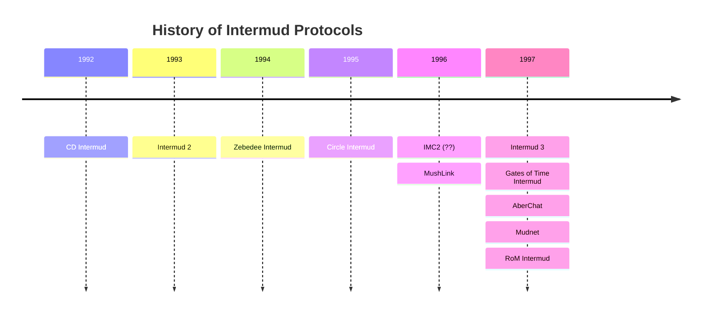
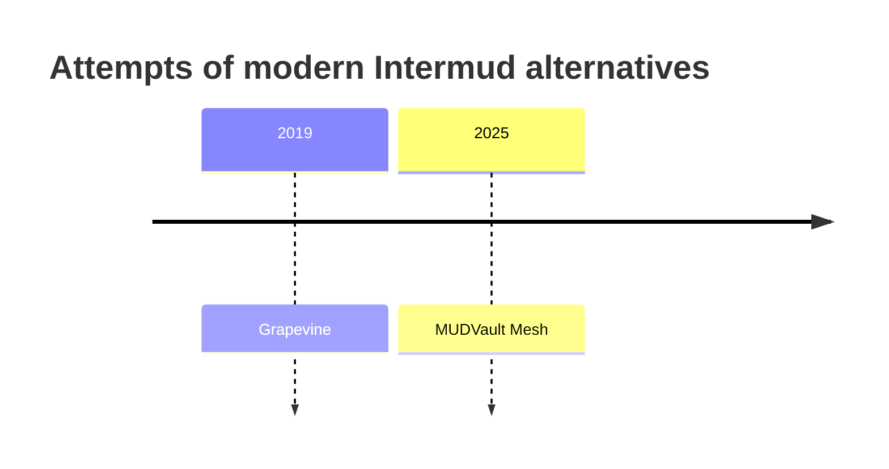

# Overview

There have been several attempts attempts to enable communication between MUDs. 
Now, 3 decades later, it is hard to get the facts right, but I give it a try.

- Intermud 1/**[CD Intermud](cd_intermud)**
- **Intermud 2** 
  Backwards compatible evolution of the CD Intermud
- **[Zebedee](zebedee)** (often also called "Intermud 2") 
  Popular especially in Europe, this protocol used UDP messages in a full mesh 
  of MUDs where every was able to provide a list of peers. Still in use today.
- **[Inter MUD Communications (IMC2)](imc2.md)** 
  This TCP-based protocol uses a centralized router and originates in the 
  Merc/Ency/ROM/Diku World. Still in use today, since a bridge to the I3
  network exists.
- **[AberChat](aberchat)** 
  A very basic implementation via TCP, making use of a central router. As good
  as dead today.
- **[InterMer](merentha)** (Merentha Internet Service) 
- **[Intermud3](intermud3)** (I3) 
  A TCP-based protocol with payloads that are complicated to use outside the LPC
  world. Still potentially the largest network remaining today.
  

There are other networks that are not native MUD networks like **Grapevine** that have been used for a while. 
At least Grapevine seems to be dead today too.

## Comparison

|                | Intermud1/2 | Zebedee | Circle | IMC2 | MUSHLink | Intermud3 | Merentha | Aberchat | MUDVault |
| -------------- | :---------: | :-----: | :----: | :--: | :------: | :-------: | :------: | :------: | :------: |
| Transport      |     UDP     |   UDP   |  UDP   | TCP  |   TCP    |    TCP    |   UDP    |   UDP    |   TCP    |
| Layout         |    Mesh     |  Mesh   |  Mesh  | Star |   Star   |   Star    |   Mesh   |   Mesh   |   Star   |
| Default Port   |    +2/+4    |   +6    |        |      |          |    +8     |  10006   |          |   8084   |
| Message Size   |     1k      |   4k    |        |  -   |          |     -     |    ?     |    ?     |    -     |
|                |             |         |        |      |          |           |          |          |          |
| **Features**   |             |         |        |      |          |           |          |          |          |
| MUDLIST        |      ✔      |    ✔    |   ✔    |  ✔   |    ✔     |     ✔     |    ✔     |    ✔     |    ✔     |
| WHO            |      ✔      |    ✔    |   ✔    |  ✔   |    ✔     |     ✔     |    ✔     |    ✔     |    ✔     |
| FINGER         |      ✔      |    ✔    |   ❌    |  ✔   |    ❌     |     ✔     |    ✔     |    ❌     |    ✔     |
| LOCATE         |      ❌      |    ❌    |   ❌    |  ❌   |    ❌     |     ✔     |    ❌     |    ❌     |    ✔     |
| TELL           |      ✔      |    ✔    |   ✔    |  ✔   |    ✔     |     ✔     |    ✔     |    ✔     |    ✔     |
| EMOTETO        |      ❌      |    ❌    |   ❌    |  ✔   |    ❌     |     ✔     |    ❌     |    ❌     |    ✔     |
| GOSSIP         |      ✔      |    ✔    |   ❌    |  ❌   |    ❌     |     ✔     |    ❌     |    ✔     |    ✔     |
| ADMINCHAT      |      ✔      |    ✔    |   ✔    |  ❌   |    ❌     |     ✔     |    ✔     |    ✔     |    ✔     |
| MUDMAIL        |      ❌      |    ✔    |   ❌    |  ❌   |    ✔     |     ✔     |    ❌     |    ❌     |    ❌     |
| Other channels |      ❌      |    ✔    |   ❌    |  ❌   |    ❌     |     ✔     |    ❌     |    ❌     |    ✔     |
| PORTAL         |      ❌      |    ✔    |   ❌    |  ❌   |    ❌     |     ❌     |    ❌     |    ❌     |    ❌     |
| Paging         |      ❌      |    ❌    |   ✔    |  ✔   |    ❌     |     ❌     |    ❌     |    ❌     |    ❌     |

