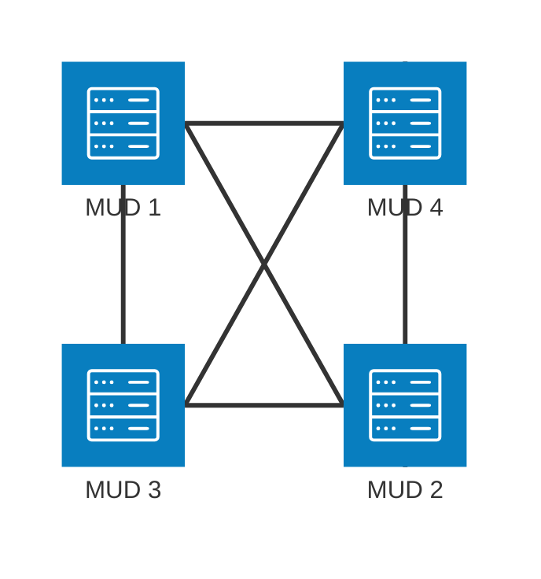

:::note
**Source**: [http://mud.stack.nl/intermud/zebedee.protocol.html](https://web.archive.org/web/20051229142240/http://mud.stack.nl/intermud/i2.protocol.html)
Also: [Zebedee Inetd Services](https://web.archive.org/web/20011218124054/http://mud.stack.nl/intermud/zebedee.html)
Also: [Portals](https://groups.google.com/g/de.alt.mud/c/UR0xHq0YARc/m/HywTEp1LMgoJ) and used [source](https://github.com/unitopia-de/lp245.git)

The CD protocol was quite basic and easy to implement, however it has some important drawbacks: It is not possible to send messages longer than 1kb. Only 1 intermud channel is implemented. And there is no message acknowledgement - even though many packets are lost due to the unreliability of the UDP (user datagram protocol) used. So the protocol is not really fit for sending mud-lists, mail or files.

All flaws of the CD-implementation are taken care of in it the new intermud protocol distributed as the "Inetd" package. This was created by **Nostradamus@Zebedee** (Mark Lewis). Here a message can be send in several parts and if no acknowledgement is received, a message is send again (up to 3 times). The inetd distribution can be easily added in many LPC mudlibs although it was primary designed for Amylaar (with CD compability in mind!)

A great extension providing intermud-mail is included in the latest distributions. This mail protocol was developed on top of Zebedee's implementation by **Alvin@Sushi** (James W. Armstrong). The latest (and most likely last ever) version is Inetd v0.7 beta 2, which was released in September 1996(?) The first implementation of this protocol was available late 1993 (maybe even earlier).
:::

# Zebedee Intermud



## Initializing
On start-up the MUD that wishes to connect must load a static [MUD list](#the-mud-list-format) from a well known source (e.g. file system). Within this list there a known peers for Zebedee communication.


This file was originally written as a brief outline of the intermud protocol for use by developers interested in incorperating similar, compatible intermud protocols into their own mud systems. It is included here as it provides a much more detailed description of the intermud protocol than that provided by the original PROTOCOL file, and hence may be of use to LpMud developers.

## PACKET PROTOCOL / FORMAT

All information is transferred as a string via a UDP port (each mud has 1 send and 1 receive port). This kindof transfer is inherently unreliable, but it's fast and doesn't use up file descriptors. The format of the strings (packets) is as follows:

```
header1:body1|headerN:bodyN|DATA:body-data
```

In other words, a header name, followed by a : and then the data associated with this header. Each header/body pair is separated by the | character. This means that headers and their body cannot contain the | character. You should check for this in outgoing packets to aviod decoding errors at the recieving end. The exception to this is the DATA field. If it is present, it is ALWAYS positioned at the end of the packet. Once a DATA header is found, everything following it is interpreted as the body of the DATA field. This means it can contain special characters without error and it is used to carry the main body or data of all packets.

By convention, predefined system fields will use capital letters for field headers and custom headers used by specific applications will use lowercase names to avoid clashes. The defined system fields are generally refered to by a set of macros which are defined in a common header file for clarity.

There is one exception to this header format; If the data is too large to be transmitted in one single packet, it will be split into packets of convenient size, each with a special unique packet header to enable them to be reassembled at the receiving end. These headers are of the format:

```
PKT:mudname:packet-id:packet-number/total-packets|rest-of-packet
```

In this case, the mudname and packet-id combine to form a unique id for the packet. The packet-number and total-packets information is used to determine when all buffered packets have been received. The rest-of-packet part is not parsed, but is stored while the receiver awaits the other parts of the packet. When/if all parts have been received they are concatenated and decoded as a normal packet.

------

## PACKET ENCODING / DECODING

Only 2 generic data types are fully suported within the inetd code itself (namely strings and integers), though others can easily be used by converting them to one of the supported data types before transfer and converting back again in receipt. The LpMud "object" data type is converted to a string automatically by the inetd on encoding, but no such conversion is carried out on decoding.

On encoding integers are simply converted to a corresponding string. Strings are left untouched as long as there is no ambiguity as to wether they should be decoded as a string or an integer. In this case of ambiguity, the string is prepended with a $ character. If the first character of a string is the $ character, it is escaped by prepending another $ character. On decoding, any string with a $ as its first character will have it removed and will then be treated as a string. Any remaining strings that can be converted to an integer and then back to a string with no loss of information are considered to be integers. Any remaining strings are treated as such and are left unaltered.

------

## DEFINED SYSTEM HEADERS

- "RCPNT" (RECIPIENT)

  The body of this field should contiain the recipient the mesage is to be sent to if applicable.

- "REQ" (REQUEST)

  The name of the intermud request that is being made of the receiving mud. Standard requests that should be supported by all systems are "ping" (PING), "query" (QUERY), and "reply" (REPLY). The PING request is used to determine wether or not a mud is active. The QUERY request is used to query a remote mud for information about itself (look at the udp/query module for details of what information can be requested). The REPLY request is special in that it is the request name used for all replies made to by mud B to an initial request made by a mud A. It is mud A's responsibility to keep track of the original request type so that the reply can be handled appropriately.

- "SND" (SENDER)

  The name of the person or object which sent the request or to whom replies should be directed. This is essential if a reply is expected.

- "DATA" (DATA)

  This field should contain the main body of any packet. It is the only field that can contain special delimiting characters without error.

The following headers are used internally by the inetd and should not be used by external objects:

- "HST" (HOST)

  The IP address of the host from which a request was received. This is set by the receiving mud and is not contained in outgoing packets.

- "ID" (ID)

  The packet id. This field is simply an integer which is set by the sending inetd. The number is incremented each time a packet is sent (zero is never used). This field is only needed if a reply is expected. REPLY packets _must_ include the original request id. This is _not_ done by the inetd.

- "NAME" (NAME)

  The name of the local mud. Used for security checking and to update host list information.

- "PKT" (PACKET)

  A special header reserved for packets which have been split. See PACKET PROTOCOL / FORMAT.

- "UDP" (UDP_PORT)

  The UDP port the local mud is receiving on. Used for security checking and updating host list information.

- "SYS" (SYSTEM)

  Contains special system flags. The only system flag used at present is TIME_OUT. This is included in packets returned due to an expected reply timing out to differentiate it from an actual reply.

------

## UDP REQUESTS / MODULES

The following are standard request types that must be supported by all systems:

### "ping" (PING)

  This module should return a REPLY packet that contains the original requests ID in it's ID field and the SENDER in it's RECIPIENT field. It should also include an appropriate string in the DATA field, eg. "Mud-Name is alive.\n"

### "query" (QUERY)

  This module expects the type of query requested to appear in the recieved DATA field. It should return a REPLY packet containing the original ID in the ID field, the SENDER in it's RECIPIENT field, and the query type in a QUERY field. The DATA field should contain the information requested.

For details of how other intermud requests operate, look at the relevant module code.


## Zebedee's Inetd Services
A good protocol definition and implementation are available (from Nostradamus@Zebedee), however I didn't find a good list of available services and commands. So I created this list myself, based on the implementation.

Note that the fields "NAME" and "UDP_PORT" should be present in every message. Very common are the fields "ID" (used whenever an reply is expected) and "SND" (the sender: he should receive the reply). These fields will not be mentioned in the list below.

### channel
    The channel-request is used for sending a message on any channel. The "CMD" field is optional and may be omitted for normal messages. Note that you should not send an history or list request to _all_ known muds!
    
    "CHANNEL"
        The channel on which a message is send (the standard channels are "intermud", "intercode", "interadm", "d-chat", "d-code" and "d-adm"; on the d-channels German is spoken)
    
    "DATA"
        The message to be send (not used with history/list request)
    
    "CMD" (optional)
    
        ""
            for normal intermud messages,
    
        "emote"
            if the message is an emote,
    
        "history"
            for an history request: the last 20 lines of this channel will be shown.
    
        "list"
            to list all remote users listening to this channel 
    
    "EMOTE" (optional)
    
        1
            The message is a normal emote.
    
        2
            The message is a gemote. 

### finger
    Retreive information about a player or creator on a remote mud.
    
    "DATA"
        The player of whom information is requested 

### locate
    Check whether a certain player is logged on at a remote mud. This request is usually send to all known muds at the same time.
    
    "user"
        Name of the person who requests the information.
    
    "vbs"
        The verbose option has only two pre-defined values:
    
        1
            Even report when the result was negative
    
        2
            Don't do timeouts, but keep waiting 
    
    "fnd"
        The found option is only used in the reply and it's value is either 1 (success) or 0 (failure). The absence of a found parameter indicates failure as well. 
    
    "DATA"
        The player to find. 

### man
    Retreive a manual page from a remote mud. Many muds don't support this feature...
    
    "DATA"
        The name of the requested manual page 

### mail
    An extension to the standard protocol, by Alvin@Sushi. This is used to send mails from one mud to another.
    
    "udpm_status"
        This field should only be used in the reply and indicates how mail is handled. Currently there are four pre-defined values for the status field:
    
        0
            time out
    
        1
            delivered ok
    
        2
            unknown player
    
        3
            in spool (will be delivered later) 
    
    "udpm_writer"
        Name of the person who wrote this mail
    
    "udpm_spool_name"
        Should be returned as sent, this value is used to remove the mail from the spool directory after it has been delivered (or refused)
    
    "udpm_subject"
        Subject of the mail message
    
    "DATA"
        The body of the mail (the actual message) 

### ping
    A ping request has only the standard fields, the reply is usually a short string like " is alive."

### query
    Get standard information about another mud. This is the only command of which the reply may not include a load of rubbish, but should only hold the requested information, so that it can be parsed by the server.
    
    "DATA"
        The following queries are pretty much standard:
    
        "commands"
            List all commands that are supported by the inetd
    
        "email"
            The email-address of the mud administrator(s)
    
        "hosts"
            A listing of all hosts in a special format [t.b.d.]
    
        "inetd"
            The version number of the inetd used
    
        "list"
            The list of all items which can be queried
    
        "info"
            A short human-readable string with practically "query" information
    
        "mud_port"
            The portnumber that players connect to on login
    
        "time"
            The local time for this mud
    
        "users"
            A list of the people that are active in this mud
    
        "version"
            The version of the mud-driver (and library)
    
        "www"
            The URL of the mud's web page (e.g. http://mud.stack.nl/) 

### reply
    This request method is used for _all_ replies.
    
    "DATA"
        A human-readable string, containing the reply to a given query
    
    "RCPNT"
        The same name as in the "SND" field or the query; Usually this is the name of the player who initiated the query
    
    "QUERY"
        This field is only used in a response to a "query" request and should be equal to the "DATA" field of that request
    
    "VBS"
        This field is only used in a response to a "locate" request and should be equal to the "VBS" field of that request
    
    "FND"
        This field is only used in a response to a "locate" request and should be 1 if the player was located and 0 otherwise 

### tell
    Say something to a player on another mud.
    
    "RCPNT"
        Name of the player to whom you are talking
    
    "DATA"
        Whatever you wish to say to this person 

### who
    List the people that are active on a remote mud. The anwer usually contains some active information about the players, like titles, levels or age.
    
    "DATA"
        Not supported by many muds. Introduced August 1997.
        Additional switch(es) (space separated) that change the appearence of the resulting list. The switches normally resemble the switches used inside of that mud for the 'who' command. Typical values include:
    
        "short" "s" "-short" "-s" "kurz"
            Return a concise listing. 
        "alpha" "a" "alphabetisch" "-alpha" "-a"
            Sort the players alphabetically. 

## The MUD list format

A typical MUD list - here an example of active MUDs in July 2025 - looks like this:

```
AbendDaemmerung:178.254.21.129:4246:channel,finger,locate,tell,who:*
AgeOfHeroes:128.76.165.163:2347:channel,finger,tell,who,mail,locate:*
Aldebaran:85.214.77.105:4246:channel,finger,locate,tell,who,mail,man:*
Avalon:85.10.205.77:4246:channel,finger,locate,man,tell,who,mail,gopher:*
Beutelland:128.130.95.62:4246:tell,who,channel,finger,locate,mail:*
DeeperTrouble:172.104.251.185:8889:channel,finger,locate,tell,who:*
DevDune:138.197.134.82:6791:*:*
DragonfireII:97.95.18.87:2000:channel,finger,tell,who,mail,locate:*
Efferdland:152.53.16.20:4246:channel,finger,tell,who,mail,www,htmlwho,locate:*
EotL:38.86.32.239:4246:channel,finger,locate,man,tell,who:*
FinalFrontier:78.46.121.106:7610:channel,finger,tell,locate,who,mail,man,update,webquery:*
Kerovnia:151.198.54.56:1985:channel,finger,encoding,locate,mail,man,newsgroup,tell,who:*
Magicmud:152.53.16.20:3002:channel,finger,tell,who,mail,www,htmlwho,locate:*
MorgenGrauen:89.58.11.82:4246:channel,finger,tell,who,mail,www,htmlwho,locate:*
Nightfall:82.153.225.173:4246:channel,finger,encoding,locate,man,tell,who,mail,www:*
OuterSpace:159.69.87.242:3002:*:*
Realmsmud:68.57.196.242:4246:*:*
Seifenblase:217.11.52.247:4246:channel,finger,locate,man,tell,who,mail,gopher:*
SilberLand:77.237.49.230:4246:channel,finger,tell,who,mail,www,htmlwho,locate,man:*
Tamedhon:212.132.115.155:4246:channel,finger,tell,who,mail,www,htmlwho,locate:*
Tauros:34.221.136.93:5050:*:*
Theloria:178.254.12.82:3335:channel,finger,tell,locate,who,mail,newsgroup,portal:*
Tubmud:85.214.44.4:7683:channel,finger,locate,man,tell,who,www,mail:*
UNItopia:217.11.52.248:3335:channel,finger,tell,locate,who,mail,newsgroup:*
WL-Development:49.13.232.95:5757:channel,finger,tell,who,mail,locate,man:*
Wunderland:49.13.232.95:4246:channel,finger,tell,who,mail,locate,man:*

```

