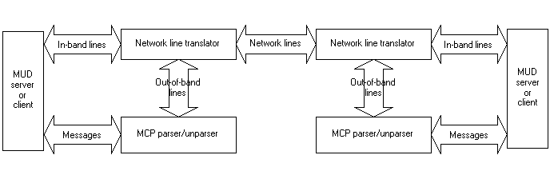

# MUD Client Protocol, Version 2.1

**Source**: [The MUD Client Protocol, Version 2.1](https://www.moo.mud.org/mcp/mcp2.html)

## 1. Introduction

Advances in MUD server design, particularly the development    of in-server programming languages, coupled with the    replacement of terminals and telnet sessions by personal    computers and customized (and frequently user-programmable)    clients have given rise to a demand for MUD-based applications    which make use of modern client capabilities such as windowing    systems, local file storage, and richer text display. At the    same time, many MUD servers have retained the model of a single    7-bit ASCII channel per client, constraining the application    author's ability to design protocols.

The MUD Client Protocol (MCP) defines a simple and standard    message format for the protocols used in constructing these    applications. It is designed to be readily distinguished from    the normal stream of MUD output and user commands and easily    parsed.

## 1.1 Motivation and Goals

MCP is an attempt to provide a standard message format on    which to build MUD-based client-server applications. As    described above, many MUDs place restrictions on the user's I/O    channel. Given these, a survey of MCP's goals is in order:

- MCP is simple and open-ended. Rather than attempting to        define the messages which implement applications built on        MCP, it defines the format these messages should follow,        and leaves the details of protocol message design to        application authors.
- It is expressed in 7-bit ASCII, permitting it to be        carried over channels with restricted character sets.
- Its messages have a distinctive format; they may be        carried on the same channel with, and readily recognized        and removed from, the stream of "in-band" MUD commands and        output.
- MCP makes only minimal distinctions between clients and        servers. In this respect, it is applicable both to        traditional client-server communications and to        server-to-server communications.
- MCP has little notion of state; instead, maintenance of        state beyond the existence of a MCP-capable connection        between the server and client is assumed to be the job of        application-specific protocols.

## 1.2 Terms and concepts

Much of MCP is described in terms which require some    understanding of the typical MUD architecture (that is, a    central server reflecting messages among, and generating    messages to, multiple clients). For the reader who is    unfamiliar with MUDs, the terms used may be somewhat unclear.    This section attempts to document some of the terms used in    this specification.

- **MUD**

  A generic term for a networked, shared virtual        environment.

- **Server**

  The MUD "world". A network service which implements the        MUD's shared space.

- **Client**

  A program used to connect to a MUD server.

- **Connection Endpoint**

  Since, for most part, MCP is peer-to-peer and has no built-in concept of "client" or "server", we use        *connection endpoint* to refer to either a client or a server. Likewise "implementations" should be taken to        mean either client or server implementations of MCP. Where clients and servers need to behave distinctly, the        specification will refer to "clients" or "servers" specifically.

- **Session**

  A *session* is a bidirectional stream of network lines*. MCP requires that each direction of        this stream guarantee ordered, reliable message delivery,        but there need not be synchronization between the two        directions. The standard implementation of a session is a        TCP connection; however, any protocol which meets the        session requirements may be used. The term "session" is        also used to refer to the bidirectional stream of MCP        *messages* derivable from a given stream of network        lines.

- Network Lines

  A *network line* consists of a sequence of        (ASCII) bytes terminated by a network newline. MCP does not        impose a line-length restriction, and the definition of        "network newline" depends on the network over which MCP is        carried (and consequently is not specified here). A        connection endpoint receiving a network line must interpret        the line as an *in-band* or *out-of-band*        line.

- **In-band lines**

  *In-band* lines are those that are to be        processed by a connection endpoint in the default manner,        e.g., being interpreted as ordinary (MUD) command input by        a server or being immediately displayed to a user by a        client in its default window. MCP places no restriction on        the form/contents of in-band data apart from their division        into lines and the quoting requirements described        [below](https://www.moo.mud.org/mcp/mcp2.html#netlintran). All network lines not        beginning with the literal string #$# are        interpreted as in-band lines.

- Out-of-band lines, message lines

  *Out-of-band* lines are those that are to be        processed in some non-default manner, e.g., lines sent to a        client that are directed at some specific client facility,        or lines sent to a server that are not part of the main        command stream. MCP is a standard for the        format/transmission of these out-of-band lines. Out-of-band        lines are also referred to as MCP *message lines*.        All network lines beginning with the literal string        #$# are interpreted as out-of-band lines.

- **Messages**

  An MCP *message* is a structured entity        consisting of a *message name* identifying the class        (kind) of the message (usually indicating an action to be        taken), an *authentication key*, and a        keyword-to-value mapping that comprises the        *arguments* of the message. How a given MCP message        is formatted as a sequence of out-of-band lines is        described [below](https://www.moo.mud.org/mcp/mcp2.html#msgfmt). The term "message"        can refer to the entire class of messages having a given        message name as well as to particular instances of that        class.

- **Packages**

  MCP *packages* (or *protocols*) are suites of MCP messages (i.e., message classes) used to implement an application. Typical packages include the MCP version negotiation and cords packages, which are described        later in this document.

## 1.3 A historical note on versions

This document describes version 2.1 of MCP; version 1.0 is    described in the form of    [online     help at JHM](http://jhm.ccs.neu.edu:7043/help/subject!mcp) (telnet://jhm.ccs.neu.edu:1709), and    written by Erik Ostrom, Dave Van Buren, Pavel Curtis, David    Nichols, and Jay Carlson. A number of implementations revised    and extended this specification, and some of those    implementations advertised themselves as version 2.0. This    specification includes features from some of those existing    systems. Because, however, there are significant departures    from these implementations, it was decided to number this    specification 2.1 to avoid conflicts.

## 1.4 An overview of this specification

MCP 2.1 consists of a number of cooperating parts. Some of    the parts specified here are required for any compliant MCP 2.1    implementation. Others are optional; however, implementations    are *strongly* encouraged to implement the optional    parts of MCP 2.1. Experience has shown that these optional    components are extremely useful. The components covered by this    specification and their status (required or optional) are:

- [Network Line Translation](https://www.moo.mud.org/mcp/mcp2.html#netlintran):        *required*

- ​            MCP Message format              

  - [Simple Message format](https://www.moo.mud.org/mcp/mcp2.html#msgfmt):                *required*
  - [Multiline message                 format](https://www.moo.mud.org/mcp/mcp2.html#multiline): *optional*

- [Error Handling](https://www.moo.mud.org/mcp/mcp2.html#errors):        *required*

- Startup sequence

  - [The mcp                 message](https://www.moo.mud.org/mcp/mcp2.html#mcpmsg): *required*
  - [The versioning                 algorithm](https://www.moo.mud.org/mcp/mcp2.html#versioning): *required*

- [Packages](https://www.moo.mud.org/mcp/mcp2.html#packages): *required        (implementations must comply with naming        standards)*

- Standard Packages

  - [The                 mcp-negotiate package](https://www.moo.mud.org/mcp/mcp2.html#mcpnegot):                *required*

  - The mcp-cord                    Package

    : 

    optional

    - [Cord-related MCP                         messages](https://www.moo.mud.org/mcp/mcp2.html#cordmsg): *required* for cord                        implementations

Implementations which choose not to implement the optional    parts of this specification *must not* provide features    which conflict with the optional parts. In particular,    implementations which choose not to implement cords or    multiline messages are forbidden from using the following    messages in other packages: #$#*,    #$#:, #$#mcp-cord-open,    #$#mcp-cord, and #$#mcp-cord-closed.    Implementations which do not implement multilines should treat    a parameter with an asterisk at the end of its name as an    error.

## 1.5 A Model for an MCP Implementation

MCP is intended to solve the problem of identifying and    routing out-of-band information in a single network stream.    This suggests a model for implementations to follow consisting    of three active components and four data flows, reflected on    either end of the network stream. A graphic view of this model    is shown here:

------



------

Network lines are transmitted between *network    translation* layers, which identify the lines as either    *in-band* lines (which, modulo quoting, are exchanged    directly between the MUD client and server and the network), or    *out-of-band* lines. Out-of-band lines are handled by an    MCP parser, which turns them into messages to be handled by the    client or server.

This specification is primarily concerned with the details    of messages entering and leaving the MCP parser. The job of the    network line translation layer will be dealt with briefly,    followed by the details of parsing an MCP message. Finally, the    specification presents the details of version negotiation and    presents a typical MCP *package*, a protocol built on    MCP.

## 2. MCP Message Specification

## 2.1 Network Line Translation

MCP implementations require a translation layer between    their message-handling system (which processes out-of-band    message lines) and the network to which the system is attached.    The job of this translation layer is to translate *network    lines* into *in-band lines* and *out-of-band    lines*, and route these lines appropriately.

When receiving a network line, the translation layer should    apply the following rules:

- A received network line that begins with the characters ``#$#`` is translated to an out-of-band (MCP message) line consisting of exactly the same characters.
- A received network line that begins with the characters ``#$"`` must be translated to an in-band line consisting of the network line with the prefix   ``#$"``removed. This method is used to quote lines beginning with #$# or #$" . For example, the network line:             
  ```
  #$"#$#this isn't: really an: "out-of-band message"
  ```

  must be translated to:             

  ```
      #$#this isn't: really an: "out-of-band message"
  ```

  and treated as an in-band line by the implementing MUD or client.        

- Any other received network line translates to an        in-band line consisting of exactly the same        characters.

When sending lines to the network, the translation layer    should apply the following rules:

- Every in-band line to be sent must be quoted before        sending by prefixing it with the string #$",        if the line begins with either the characters        #$# or the characters #$".
- In-band lines which do *not* begin with the        strings mentioned above, as well as all out-of-band        messages, require no quoting.

## 2.2 Message Format

```
<message> ::= <message-start>
           | <message-continue>
           | <message-end>
<message-start> ::= <message-name> <space> <auth-key> <keyvals>
```

An MCP message consists of three parts: the name of the    message, the authentication key, and a set of keywords and    their associated values. The message name indicates what action    is to be performed; if the given message name is unknown, the    message should be ignored. The authentication key is generated    at the beginning of the session; if it is incorrect, the    message should be ignored. The keyword-value pairs specify the    arguments to the message. These arguments may occur in any    order, and the ordering of the arguments does not affect the    semantics of the message. There is no limit on the number of    keyword-value pairs which may appear in a message, or on the    lengths of message names, keywords, or values.

### 2.2.1 Keywords

```
<keyvals> ::= '' |  <space> <keyval> <keyvals>
<keyval> ::= <key> ':' <space> <value>
<key> ::= <simple-key> | <multiline-key>
<simple-key> ::= <ident> 
<multiline-key> ::= <ident> '*'
```

Each argument to a message is named by a *keyword*.    The keyword consists of an identifier (a string matching the ``<ident>`` nonterminal), optionally followed by    an asterisk; if the asterisk is present, the value to follow is    a multiline value. If no asterisk is present, the value is    simple. Messages may contain a mixture of simple and multiline    values.

Implementations should never send a simple message with    duplicate argument keywords on the same line; for example, the    message

```
    #$#say 12345 what: "Hi there!" WHAT: "Hey there..." from: Biff to: Betty
```

should not be generated, and should be dropped as an error    if received.

### 2.2.2 Simple values

```
<value> ::= <unquoted-string> | <quoted-string>
```

The *value* associated with a keyword may be either *simple* or *multiline*. A simple value is an ``<unquoted-string>`` or ``<quoted-string>`` supplied entirely in the same    MCP message line as its keyword, and separated from the keyword    by a colon and one or more spaces. Every keyword has an    associated simple value, even if the keyword names a multiline    value.

For example, the message

```
    #$#say 12345 what: "Hi there!" from: Biff to: Betty
```

contains 3 keyword-value pairs, all with simple values. The    message name is say, and the authentication key is    12345. The keywords are what,    from, and to; the values associated    with these keywords are Hi there!,    Biff and Betty respectively.

Simple values containing no spaces, quotation marks,    backslashes, colons, or asterisks (in other words, those values    matching the ``<unquoted-string>`` nonterminal in    the grammar given in the [appendix](https://www.moo.mud.org/mcp/mcp2.html#appendix)) may    be sent without quoting; other values (for example, those that    contain spaces) must be quoted as strings. However, values have    no inherent type. The values 3 and    "3" are equivalent. It is up to the handler for a    given message to determine whether the value is to be treated    as a number or as a string.

Message names and keywords are case-insensitive. The message    name mcp-negotiate-can is exactly equivalent to    the message name MCP-Negotiate-Can, and the    argument keyword what: is identical to    WHAT:. Authentication keys *are* case    sensitive, however, and implementations must preserve the case    of argument values.

### 2.2.3 Multiline values

```
<message-continue> ::= '*' <space> <datatag> <space> <simple-key> ':' ' ' <line>
<message-end> ::= ':' <space> <datatag>
<datatag> ::= <unquoted-string>
<line> ::= <string-char>*
```

A *multiline* value is one which is spread over a    series of MCP message lines; these values are frequently used    to represent blocks of data conveniently represented as lists;    for example, the source code to a program, or a block of text    lines.

Compliant MCP 2.1 implementations are *not* required to implement multiline values if they are not necessary to the    application for which the implementation is to be used.    Specifically, if an implementation is designed to support a    fixed set of packages, none of which use multiline values,    there is no need to provide support for multilines. If,    however, the implementation may at some point be extended to    provide support for packages beyond those it was originally    designed to support, implementation of multilines is    encouraged.

If there is an asterisk after the keyword in a keyword-value pair, the value is multiline. Although a simple value is    required syntactically, it will be ignored. (Typically the    empty string, "", is used.)

The real value is sent as a series of lines after the first one (hence the name). These lines *need not* be    consecutive; they may be interspersed with other text,    including other MCP messages, and lines from different    multiline values in the same message may be interspersed.    However, the lines within each value must be sent in order.    There is no limit on the number of lines in a multiline    value.

If there are any multiline values, the message must include a keyword named _data-tag. This, in combination    with the value's keyword, will be used to flag subsequent    lines. Data tags are case-sensitive (implementations must not    vary the case of any alphabetic characters in the tag between    the _data-tag argument and the multiline value, or    within the multiline value itself), and may be any string of    characters matching the ``<unquoted-string>``    nonterminal in the MCP grammar.

The values of multiline arguments are supplied in    *continuation* messages, which begin with the literal    string #$#*. While these messages have a syntax    similar to typical MCP messages, they have some    peculiarities:

- The value supplied in the _data-tag        argument is used in place of the authentication key.
- Each continuation message has only one keyword-value        pair, which supplies a portion of the multiline value for        the keyword; everything after the keyword is considered        part of the value, and should not be parsed for additional        keywords or quoting.

Once all value lines have been sent for all multiline values    in the message, the implementation sends the    *message-end* message: the literal string    #$#: followed by the data tag.

Here is an example of a message with a multiline value:

```
    #$#spam 12345 from: Biff text*: "" _data-tag: 9b76
    #$#* 9b76 text: This is some sample text.
    #$#* 9b76 text: 
    #$#* 9b76 text: Note that you don't need to quote strings
    #$#* 9b76 text: in multiline data.  Also, you can include "special"
    #$#* 9b76 text: characters like quotes.  Everything after the
    #$#* 9b76 text: space after the keyword and colon is considered
    #$#* 9b76 text: part of the value.
    #$#* 9b76 text:     This means that spaces can also be part of the value.
    #$#: 9b76 
```

Multiline values lack authentication keys; the data tags are    roughly as secure as the authentication key argument on regular    MCP messages (that is, not very), and their lifetime is only    the length of a multiline message. For this reason, however,    implementations should use some care in the choice of multiline    value data tags (specifically, the same care taken in selecting    authentication keys. See the [authentication     keys](https://www.moo.mud.org/mcp/mcp2.html#authkeys) for some guidelines), and should ignore messages for    which no matching _data-tag argument has been    seen.

Moreover, implementations must ensure that data tags are    unique over their lifetimes; that is, an implementation must    not generate a new tag matching a previously-generated tag    before the *message-end* message for that tag has been    sent.

Multiline values are generally used to represent lists of    items; for example, lines of code or quoted text.    Implementations should preserve the line divisions implicit in    multiline messages so that package implementations may make use    of this information.

## 2.3 Error Handling

In general, MCP implementations should be as unobtrusive as    possible. If an unrecognized or mangled MCP request is    received, the implementation should either silently drop it on    the floor, or notify the user in some reasonably unobtrusive    way. Similarly, applications should be prepared to handle (by    ignoring) unexpected additional arguments on messages.    "Mangled" messages here include multiline value messages for    which a *message-end* message has already been seen, or    with a keyword whose initial occurrence (in the message having    the _data-tag argument) was not followed by an    asterisk. Implementations may (and are encouraged to) provide    debugging modes which are more verbose than the default silent    mode specified here.

## 2.4 Startup Sequence

In initializing MCP communications, the server and client    negotiate version and package support. The negotiation makes    use of 2 messages: mcp and    mcp-negotiate-can. The former message is sent at    the beginning of the session; it must precede ALL other MCP    communication. The latter message is used to indicate support    for MCP packages.

### 2.4.1 The mcp message

The mcp message should be the first message    sent by the recipient of a connection (usually a MUD server)    when a connection initiator (usually a client) connects or    reconnects. It indicates that the server is capable of    supporting MCP and the MCP versions supported. The message has    two arguments: version indicates the minimum    protocol version supported by the server and to    indicates the maximum protocol version supported by the server.    In both cases, the argument value is in the form    major.minor, where major and    minor should be read as unsigned integers with no    leading zeroes. Both arguments are required. Note that MCP 1.0    also supported version advertisement, but not of a range of    versions; the names of the arguments for the mcp    message were chosen to allow version handshake between version    2.1 and 1.0 implementations (which will simply discard the    to argument and decide whether to use MCP based on    the version argument).

When a client disconnects from, or reconnects to the server,    all stored MCP information about the client should be reset,    and a new mcp message sent.

Example:

```
    #$#mcp version: 2.1 to: 2.1
```

This message indicates the server supports MCP, version 2.1    only.

#### 2.4.1.1 A note on version ranges

In this and all version ranges, advertising a range of    versions indicates that *all* versions in the range are    supported. For example, a server sending an mcp    message with the version parameter set to    1.0 and a to of 2.1    *must* support MCP version 1.5 if such a    version existed; (it doesn't; the only released versions of the    MCP specification have versions 1.0 and 2.1; see the historical    note in the introduction for more information about implemented    versions). If there is any doubt about whether an intermediate    version exists or is supported, an implementation should    advertise a range including only those versions *known*    to be supported.

On receipt of the mcp message, the client sends    an mcp message in reply, with slightly different    arguments (the client should *not* attempt to send any    MCP message to the server, including the mcp    message itself, until after an mcp message has    been received from the server). The message from client to    server has 3 arguments: authentication-key, a string    to be used as a key on later messages, and version    and to, which are defined as above. All three    arguments are required.

### 2.4.2 Authentication keys

The authentication-key argument value is a string    which is to be stored as a secret on the server and used to tag    any further messages from the server to the client. While the    level of security provided by this scheme is minimal    (especially since the authentication key will be repeatedly    transferred across the wire in cleartext), it provides a simple    and fairly basic protection against "spoofed" MCP messages.    Once the authentication key has been chosen, it is used as the    authentication-key argument on all subsequent    messages. Implementations should reject any message containing    a key which does not match their stored copy. The only messages    which may be transmitted without an    authentication-key argument are the initial    mcp message and the mcp message which    sets the authentication key.

Example:

```
    #$#mcp authentication-key: 18972163558 version: 1.0 to: 2.1
```

This message indicates that the client supports MCP,    versions 1.0 through 2.1, and indicates that the authentication    key for the session is 18972163558. Note that while this    particular key is composed entirely of digits, the    authentication-key argument need not be numeric, and    may be any value which matches the syntax of an  ``<unquoted-string>``.

In choosing an authentication key, the client should take    care to ensure that the key is not easily guessed, as    possession of the authentication key (along with the ability to    send lines of text to the implementation, an ability possessed    by all users on some MUDs) permits the spoofing of MCP    messages. In most cases, a spoofed message should be an    annoyance at worst. However, it is easy to envision packages    based upon MCP in which a spoofed message could be    disastrous.

### 2.4.3 Versioning Algorithm

Each side of the connection, once it knows the MCP version    range supported by the other, should compare the protocol    versions supported by the implementation and the other side; if    the supported ranges overlap, the highest version from that    overlap should be used. If there is no overlap, the    implementations cannot communicate using MCP.    Algorithmically:

------

**function** *mcp-version*(client-min,    client-max, server-min,    server-max)

1. if ( client-max  \>=  server-min and server-max >=  client-min ) 

   then

   **return** *min*(server-max,                client-max)

2. else

   **return** NONE

------

Where client-min, client-max,    server-min, and server-max are the    minimum and maximum versions from the client and server    mcp messages. Version numbers are compared for    magnitude by comparing first the major, then the minor    part:

------

**function** *version-geq*(v1,    v2)

1. if

   (

   v1.major

    \> 

   v2.major

   )            

   then

   1. **return** TRUE

2. else if

   (

   v1.major

    =            

   v2.major

   and

   v1.minor

   ​            \>= 

   v2.minor

   ) 

   then

   1. **return** TRUE

3. else

   1. **return** FALSE

------

Once a version has been negotiated (and not before), both    sides may send other MCP messages. The client may proceed as    soon it sends its mcp message, since it has    already received the server's mcp message. The    server must wait to send any other MCP messages until an    mcp message is received from the client.

## 2.5 Packages

MCP groups messages into *packages*. A package is    simply a group of messages with a name and version. Generally,    a package will be used to implement a particular application:    for example, client-local editing of server text. A package    name is a hyphen-separated sequence of valid MCP identifiers.    While this name is interpreted hierarchically with the leftmost    identifier being the most significant, the administration of    package naming is, with the exception of the rules below,    currently *unspecified*. As such, package designers must    exercise caution in choosing package names so as not to    conflict with existing packages (especially for common names,    such as edit, for which a number of conflicting    implementations can be imagined.) To alleviate this problem,    some rules and suggestions apply to package and message    names:

- MCP messages in a package should be created by        prefixing the package name to the message; for example, the        send message in the (hypothetical)        mcp-edit package is        mcp-edit-send. The null message is permissible        here: mcp-edit may also be a message in the        mcp-edit package.
- Package names beginning with the identifier        mcp are reserved for packages required or        recommended in this and future versions of the MCP        specification.
- Package names beginning with the string 'dns', followed        by a valid DNS name, reversed and having periods replaced        by dashes, are reserved for use by the organization        controlling the DNS name. These organizations are free to        further subdivide this namespace: package names beginning        with the string dns-com-yoyodyne are reserved        for use by the organization controlling the domain        yoyodyne.com. This organization may choose to        further subdivide this space into "package spaces": If the        FuzzySpace project at Yoyodyne Industries developed an        edit package, they may be assigned the        dns-com-yoyodyne-fuzzyspace-edit package name        by their company. The details of, and policies for these        assignments are not specified here. Experimental package        implementations should use this naming scheme, rather than        the traditional (but flat, and hence prone to collision,)        x-packagename-style names.
- The remainder of the top-level namespace is left        unassigned; package implementations should not use these        names. The authors anticipate the creation of a naming        authority for these top-level names. These names differ        from the names prefixed with mcp in that the        latter is reserved for packages required or recommended as        part of the MCP specification, while the remainder of the        top-level hierarchy is to be assigned according to the        policies of the naming authority.

## 3. Standard Packages

Most MCP packages will be application-specific suites of    messages to solve a particular problem. However, MCP defines    two *standard* packages. The first of these, the    mcp-negotiate package, is a critical part of the    MCP startup sequence, and all MCP implementations are required    to implement it. The second, the mcp-cord package,    allows the creation of multiple communications channels within    MCP's single channel. Implementations are strongly suggested,    but not required, to provide support for cords. Its presence in    the standard reflects this suggestion, and serves as an example    of a package built on top of MCP.

### 3.1 The mcp-negotiate       package

Once the server and client have agreed on MCP 2.1 as    described in [Section 2.4](https://www.moo.mud.org/mcp/mcp2.html#startup), they negotiate    the packages supported by each side and their versions. The    server and client inform each other of package capabilities    using the mcp-negotiate package, which is itself    an MCP package. All MCP 2.1 implementations are assumed to    implement at least version 1.0 of this package; they may    implement later versions (this document describes version    2.0).

The mcp-negotiate package consists of two    messages:

- mcp-negotiate-can, which is used to inform        the other side of a connection of the packages supported by        an implementation, and the range of versions        supported.
- mcp-negotiate-end, which indicates that an        implementation has sent mcp-negotiate-can        messages for all packages it supports.

The mcp-negotiate-can message has three    arguments: package, a string naming the package, and    min-version and max-version, version    numbers as above. On receipt of an    mcp-negotiate-can message, an implementation    should check the package: argument against the implementation's    list of supported packages. If the package is known by the    implementation, it should compare the min-version    and max-version arguments against the versions of    the package supported, picking the highest version from the    overlap, if any, as in the versioning algorithm described    above.

Example:

```
    #$#mcp-negotiate-can 1234 package: edit min-version: 1.0 max-version: 1.0
```

This message indicates that the sender supports the    edit package, version 1.0 only. If the receiver    also supports version 1.0 of this package, it may immediately    begin sending messages in that package (assuming it has already    sent an mcp-negotiate-can message for that    package).

Because the mcp-negotiate package is itself a    package (the version described here is 2.0) an    mcp-negotiate-can message should be sent for the    mcp-negotiate package. For a 2.0 implementation,    this message should be:

```
    #$#mcp-negotiate-can 1234 package: mcp-negotiate min-version: 1.0 max-version: 2.0
```

(With the appropriate authentication key, of course.)

Note that no ordering is necessary or imposed on the    transmission of mcp-negotiate-can messages. The    messages may be thought of as being transmitted in parallel and    simultaneously from both the client and the server. Neither    need wait for the other to express its ability to perform a    particular package before expressing its own ability to perform    that package. The reason for this is simple: an implementation    knows which packages it supports, and the purpose of the    mcp-negotiate-can is to simply inform the other    participant of that ability, so that it may begin making use of    that package in transmission.

Once an mcp-negotiate-can message has been    received for a particular package, an implementation may begin    sending messages in that package. An implementation should send    mcp-negotiate-can messages for all packages it    supports, and may begin sending these messages immediately upon    completion of the MCP version negotiation phase. With the    exception of the mcp-negotiate package, neither    the client nor the server should assume that any package is    available on the other until an mcp-negotiate-can    message is received for that package.

The mcp-negotiate-end message indicates that    mcp-negotiate-can messages have been sent for all    packages supported by the endpoint sending the message. The    message takes no argument.

Example:

```
    #$#mcp-negotiate-end 1234
```

This message indicates that the sending endpoint is done    sending mcp-negotiate-can messages; that is, it    has sent these messages for all packages it supports, and will    not send any more. Implementations should ignore any    mcp-negotiate messages received after the    mcp-negotiate-end message as errors.

To avoid some of the significant potential race conditions    lurking in package negotiation, implementations are    **not** permitted to wait for receipt of an    mcp-negotiate-end message before sending    mcp-negotiate-can messages for packages they    support. Implementations *are* permitted to wait for    receipt of mcp-negotiate-end before making use of    a package for which the implementation sending    mcp-negotiate-end has advertised support, or    before processing any MCP messages *except*    mcp-negotiate-can. This permits an implementation    to "prefer" some packages over others which support similar,    but more limited, functionality. For example, consider an    implementation which supports the hypothetical    edit, superedit, and    gonzoedit packages, and which "prefers"    gonzoedit to superedit, and    superedit to edit. On receiving this    message:

```
    #$#mcp-negotiate-can 1234 package: edit min-version: 1.0 max-version: 1.0
```

it may wish to wait for a better package before sending a    message in the edit package. Since the    implementation has not yet received the    mcp-negotiate-end message, it's still possible the    sending implementation supports superedit or    gonzoedit. On receiving a second message,

```
    #$#mcp-negotiate-can 1234 package: superedit min-version: 1.0 max-version: 1.0
```

it has a better package available, but may still wish to    wait. However, on receiving this message:

```
    #$#mcp-negotiate-end 1234
```

it knows the gonzoedit package will not be    available, and it should settle for superedit.    Note that while the implementation may wait to send any    messages in these packages until receipt of the    mcp-negotiate-end message, it may    **not** wait for this message before advertising    support for edit, superedit,    gonzoedit, and any other packages it supports.

The preceding discussion describes version 2.0 of the    mcp-negotiate package, but only version 1.0 of the    package is required for MCP 2.1 compliance. There are two    differences between version 1.0 and version 2.0 of the    mcp-negotiate package:

1. In version 2.0, an mcp-negotiate-can        message is sent for the mcp-negotiate package.        No such message is sent for version 1.0. Support for it is        implicit.
2. Version 1.0 has no mcp-negotiate-end        message.

In general, it is safe for an implementation to assume that    an MCP 2.1 implementation with which it is communicating    supports version 2.0 of the mcp-negotiate package:    because of the way the versioning and error handling for MCP    are specified, the additional messages will simply be ignored    by a compliant implementation.

### 3.1.1 Example

A complete startup, between a client supporting the    edit, mcp-cord, and spam    packages, and a server supporting the edit and    mcp-cord packages:
(**``>``** : server-to-client, **``<``** :    client-to-server)

- ``>#$#mcp version: 2.1 to: 2.1``
  The client compares these versions against its supported versions, 1.0 and 2.1, and chooses 2.1, the maximum of the overlapping version numbers.
  The client chooses an authentication key.

- ``<#$#mcp authentication-key: 3487 version: 1.0 to: 2.1``
  The server compares these versions against its supported versions and chooses 2.1, the maximum of the overlapping version numbers.

- ``>#$#mcp-negotiate-can 3487 package: mcp-negotiate min-version: 1.0 max-version: 2.0``
  The client notes that the server supports the mcp-negotiate package.

- ``> #$#mcp-negotiate-can 3487 package: edit min-version: 1.0 max-version: 1.0``
  The client notes that the server supports the edit package.

- ``< #$#mcp-negotiate-can 3487 package: mcp-negotiate min-version: 1.0 max-version: 2.0``
  The server notes that the client supports the mcp-negotiate package.

- ``< #$#mcp-negotiate-can 3487 package: mcp-cord min-version: 1.0 max-version: 1.0``
  The server notes that the client supports the mcp-cord package

- ``< #$#mcp-negotiate-can 3487 package: spam min-version: 1.0 max-version: 2.0``
  The server, which does not support the spam package, ignores this.

- ``< #$#mcp-negotiate-can 3487 package: edit min-version: 1.0 max-version: 1.0``
  The server notes that the client supports the edit package.

- ``< #$#mcp-negotiate-end 3487``
  The client is done sending mcp-negotiate-can messages.

- ``> #$#mcp-negotiate-can 3487 package: mcp-cord min-version: 1.0 max-version: 1.0``
  The client notes that the server supports the mcp-cord package.

- ``> #$#mcp-negotiate-end 3487``
  The server is done sending mcp-negotiate-can messages.

### 3.2 The mcp-cord Package

Cords are a mechanism for multiplexing additional    communications channels over a single MCP channel. Cords are    frequently used to "tie" a server object to a client object.    For example, a cord may be used to direct communications    between a server object and a window on the client display.    Ideally, the plumbing work to deliver cord messages to the    appropriate object is invisible to the applications programmer,    who should only be concerned with the messages to be sent, not    the mechanism involved in assuring that the arrive at the    appropriate destination. While cords provide no user-visible    functionality, they are an extremely useful tool in    implementing applications for which some amount of state is    shared between the server and client. The version of the    mcp-cord package described here is 1.0; its    package name for use in the MCP negotiation process is    mcp-cord.

Cords are not, strictly speaking, part of MCP 2.1, and    compliant implementations are not required to support them.    However, experience has shown that they are generally very    useful as a protocol design tool, that many extensions are made    significantly easier to construct by the presence of cords, and    that they benefit from a fast, low-level implementation. As    such, compliant implementations are encouraged to support the    mcp-cord package.

Three operations are possible on cords: they may be created,    have messages sent along them, and they may be destroyed. Each    cord has an associated unique (to the opening participant)    identifier and a type. The type is similar to an MCP package    name -- it determines the messages which may be sent along a    cord, and is used by the recipient of an open request to attach    the cord to an appropriate object.

Cords are bidirectional: once a cord is open, messages may    be sent along that cord in either direction, and either    endpoint may close the cord at any time Implementations should    *not* expect to necessarily receive a cord closed    message for a closed cord; this may happen in the case where an    implementation disconnects unexpectedly. If an implementation    receives a message on a cord which was closed, it should treat    the message as an unrecognized MCP message, silently dropping    it, or unobtrusively notifying the user.

One MCP message is defined for each cord operation. Any    message may be sent from either the server or the client.

### 3.2.1 Cord-related MCP messages

- **mcp-cord-open**(_id, _type)

    The mcp-cord-open message requests that a new cord be created between the source and recipient of the message, having the specified identifier and type. On receipt of this message, an implementation should check if the specified type is understood. The semantics of "is understood" are fuzzy and up to the implementation -- most implementations will presumably provide some way for code to indicate its support of a particular cord type. 
    Example:
    ```
    #$#mcp-cord-open 3487 _id: I12345 _type: whiteboard 
    ```
    The _id here, when combined with the connection endpoint which opened this cord, uniquely identifies the cord; however, since the connection endpoint will **not** be reflected in messages sent on the cord, implementations must take steps to ensure that the identifier provided is unique to a session. To this end, implementations should construct the _id argument using some variation on the following algorithm:
    ```java
    function new-mcp-cord-id()
      pick n, a value unique for this session
      if this implementation is a server
        return concat*("I", n)
      else
        return concat*("R", n)   
      ```
      The goal here is to produce IDs which are guaranteed to be different for a given pair of connection endpoints. As long as the connection endpoints generate IDs in some locally-unique (for the session) fashion, as required in line 1, and noting that any connection supported by MCP has only two endpoints, we need only distinguish the endpoints as "initiator" ("I") and "responder" ("R") to ensure that the transmitted IDs are unique for a session. The definition of "server" and "client" here is based on the position the connection endpoints took in the initial MCP startup process: the server (or "initiator") is the endpoint which sent the first MCP message. Some variation is allowed on this algorithm; as long as an implementation can strictly guarantee that no duplication will occur over the course of a session, it is free to choose any alphanumeric value for the n in the algorithm. Implementations must not assume anything about a received _id value other than that it is unique to a session.        

- **mcp-cord**(_id, _message, msgarg1... msgargn)
​  Send a message along the open cord. Note that cord messages, like MCP messages, are permitted to have arguments, and that these arguments depend on the definition of the message. The _id argument specifies the cord to which the message belongs, the _message argument specifies the message being sent along the cord, and all other arguments are considered arguments to the message being sent. There may be any number of arguments to the cord message, and the arguments may be either simple or multiline. 
  Example:
  ```
  #$#mcp-cord 3487 _id: I12345 _message: delete-stroke stroke-id: 12321 
  ```
  In this example, the stroke-id argument is an argument to the delete-stroke cord message.        

- **mcp-cord-closed**(_id)
    Indicates that one end of a connection closed the cord. Implementations should send this when the cord is to be disposed by the recipient. 
    Example:
    ```
    #$#mcp-cord-closed 3487 _id: I12345 
    ```
    Note that mcp-cord-closed messages need only be sent in one direction, by the endpoint closing the cord, and once the message has been sent, the cord should be assumed to be closed. Implementations should not expect to receive a mcp-cord-closed message in reply. However, due to potential race conditions, an mcp-cord-closed message *may* be received by an endpoint which has already sent a mcp-cord-closed message for            the same cord. As with any message on a closed cord, these messages should be ignored.        

## Authors

*Jay Carlson, Roger Crew, Ken Fox, Richard Godard, Dave    Kormann, Erik Ostrom, John Ramsdell, Vijay Saraswat, Andrew    Wilson*

Substantial additional contributions and critical comments    by Michael Brundage, William Drury, and Chris Rath.

## Appendix: BNF Grammar

The following is a somewhat extended BNF grammar for the MCP    message format. Terminals in this BNF are quoted (i.e.    '#$#'), and nonterminals appear in angle-brackets    (i.e. ``<message>``). The special (unquoted)    terminal EOL represents an end-of-line, usually a carriage    return and newline. The metacharacter | is used to    signify alternation, and ::= is used to signify nonterminal expansion. Unquoted spaces in the BNF are for formatting purposes only, and are not syntactically significant.

```
<message-line> ::= '#$#' <message> EOL

<message> ::= <message-start>
           | <message-continue>
           | <message-end>

<message-start> ::= <message-name> <space> <auth-key> <keyvals>
<message-continue> ::= '*' <space> <datatag> <space> <simple-key> ':' ' ' <line>
<message-end> ::= ':' <space> <datatag>

<message-name> ::= <ident>
<auth-key> ::= <unquoted-string>
<datatag> ::= <unquoted-string>

<keyvals> ::= '' |  <space> <keyval> <keyvals>
<keyval> ::= <key> ':' <space> <value>
<key> ::= <simple-key> | <multiline-key>
<simple-key> ::= <ident> 
<multiline-key> ::= <ident> '*'
<value> ::= <unquoted-string> | <quoted-string>

<ident> ::= <alpha> <ident-chars>
<unquoted-string> ::= <simple-char> | <simple-char> <unquoted-string>
<quoted-string> ::= '"' <string-chars> '"'

<ident-chars> ::= '' | <ident-char> <ident-chars>
<string-chars> ::= '' | <string-char> <string-chars>
<line> ::= '' | <line-char> <line>

<space> ::= ' ' | ' '<space>

<ident-char> ::= <alpha> | <digit> | '-'
<string-char> ::= <simple-char> | <space> | '\' <quote-char> | ':' | '*'
<line-char> ::= <simple-char> | <quote-char> | <space> | ':' | '*'
<quote-char> ::= '"' | '\'
<simple-char> ::= <alpha> | <digit> | <other-simple>
<other-simple> ::= '-' | '~' | '`' | '!' | '@' | '#' | '$' | '%' | '^'
        | '&' | '(' | ')' | '=' | '+' | '{' | '}' | '[' | ']' | '|'
        | ''' | ';' | '?' | '/' | '>' | '<' | '.' | ','
<digit> ::= '0' | '1' | '2' | '3' | '4' | '5' | '6' | '7' | '8' | '9'
<alpha> ::= 'a' | 'b' | 'c' | 'd' | 'e' | 'f' | 'g' | 'h' | 'i' | 'j'
        | 'k' | 'l' | 'm' | 'n' | 'o' | 'p' | 'q' | 'r' | 's' | 't'
        | 'u' | 'v' | 'w' | 'x' | 'y' | 'z'
        | 'A' | 'B' | 'C' | 'D' | 'E' | 'F' | 'G' | 'H' | 'I' | 'J'
        | 'K' | 'L' | 'M' | 'N' | 'O' | 'P' | 'Q' | 'R' | 'S' | 'T'
        | 'U' | 'V' | 'W' | 'X' | 'Y' | 'Z' | '_'
```

Note that whitespace is required in many places, but the    amount of whitespace doesn't matter except in ``<message-continue>``, in which any whitespace    after the first space after the colon will be considered part    of the ``<line>``.
