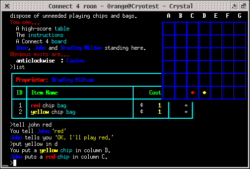

# MPLEX Telnet Option

:::note
Source: [https://musicmud.org/crystal/telopt-mplex.txt](https://musicmud.org/crystal/telopt-mplex.txt)
:::
Quick writeup of TELOPT_MPLEX, the nonstandard telnet option for doing popups on the terminal, 
used by Cryosphere and [Crystal](https://github.com/Cryosphere-MUD/crystal>) since 2002 or whenever. By morwen@evilmagic.org.

See it in action



#define TELOPT_MPLEX  0x70

server sends
``  IAC WILL TELOPT_MPLEX``

client sends
``  IAC DO TELOPT_MPLEX``

server can then use these commands.

```
#define MPLEX_SELECT  0x71
#define MPLEX_HIDE    0x72
#define MPLEX_SHOW    0x73
#define MPLEX_SETSIZE 0x74
```
(yes i know these don't need to be adjacent to the option i don't know why i did it like that)

valid screen IDs are between 0 and 254. 0 means the "main" screen. Crystal actually only
supports 0 and 1 at the moment.

```
  IAC SB TELOPT_MPLEX MPLEX_SELECT [screen] IAC SE
```
This selects a new terminal context. These should have completely different ANSI parsing state
machines, which should restore when you go back to an old one, etc etc.
```
  IAC SB TELOPT_MPLEX MPLEX_HIDE [screen] IAC SE
```
This should hide the given screen. Only valid for non-main.

```
  IAC SB TELOPT_MPLEX MPLEX_SHOW [screen] IAC SE
```

This should show the given screen. Only valid for non-main.

```
  IAC SB TELOPT_MPLEX MPLEX_SETSIZE [screen] WIDTH[1] WIDTH[0] HEIGHT[1] HEIGHT[0] IAC SE
```

This sets the size of the given screen. Same format as the NAWS subnegotation.  Only valid for non-main.
