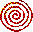

# Pueblo

 Pueblo/UE is a multimedia MUD/MUSH/MOO/MUX (MU*) client for Windows 95, 98, NT, ME, 2000, and XP. You can also use it as a regular Telnet client for line-based applications.

In addition to basic character-mode Internet connectivity, Pueblo/UE also supports ANSI colour sequences and provides simple HTML support so that specially enhanced virtual worlds can display styled text and 2D images, and play sounds. Worlds can also create forms and use clickable links to accept input, in addition to regular command-line entry. 

## Overview
Pueblo is an in-band protocol.

### Handshake

```
--> This world is Pueblo 2.50 enhanced.

<-- PUEBLOCLIENT 2.50 md5="checksum string" other_attribute1="value" other_attribute2="value" 

--> </xch_mudtext>
```

* ``2.50`` is the version number of the client.

* The ``md5`` indicates a secure checksum.  This secure string should be stored in a secure location by the world.  Pueblo will allow you to  perform some potentially abusable operations using this checksum, and  you may wish to limit the users that may perform these operations.

* Upon receiving this PUEBLOCLIENT command, the World may send the following sequence, to tell the Pueblo client to begin interpreting the World's output as HTML:

  ``</xch_mudtext>``

* 

## HTML Extensions

### Basic Extensions

#### event

> [!NOTE]
>
> This attribute (for use with VRML) is not supported in this version of Pueblo/UE.

This is an &lt;img&gt; field attribute which modifies commands that are automatically sent  from Pueblo to the world.  The format to turn on these commands is as  follows:

``&lt;img event="name" [params="parameters"] [optional parameters]&gt;``

In this case, name is the name of the event as described below.  params is used to indicate the parameters that will be sent with the automatic command and the order in which they should be sent.  In addition,  individual commands may have additional parameters associated with them.  (These are described below.)

 An automatic command for a specific event may be turned off using the following syntax:

``

#####  MOVE event

This event instructs the VRML viewer to notify the MUD server when  the viewpoint is moved.  This is usually caused by the user navigating  through the scene.  Notification consists of the PUEBLOMOVE command being sent to the MUD, followed by the parameters specified in the params attribute. Except for xch_cmd, omitting an optional field leaves that setting unchanged.  Loading a  new VRML scene resets all values to their scene defaults, which are  specified in the table below.
```xml

```
where the optional fields and their default settings are as follows:

| Parameter       | Description                                                  |
| --------------- | ------------------------------------------------------------ |
| xch_cmd         | If the value of this attribute is an empty string (""), this turns notification off.  If xch_cmd is omitted, this command will cause the notification command PUEBLOMOVE to be sent to the server.  By default, scene notification is off.  Non-empty string values are not supported. |
| xch_minTime     | The minimum interval for notification.  Default scene setting is 1000 milliseconds. |
| xch_maxTime     | The  maximum notification interval.  Notification will be sent this often  even if no movement has occurred.  Default scene setting is 10000  milliseconds. |
| xch_maxMove     | The movement distance which will trigger a notification.  Default scene setting is 0.5 meters. |
| xch_startTime   | The base time for notification.  The notification clock is set to this value upon receipt.  Default scene setting is 0. |
| xch_maxRotation | The movement rotation which will trigger a notification, in radians.  Default scene setting is 1/12 radian or 15 degrees. |
| params          | Specifies what arguments to pass in the PUEBLOMOVE command, and their order.  The default scene setting is "position". Note that the order specified is the order in which the notification arguments will be emitted.  A blank string (i.e., params="") causes just the PUEBLOMOVE command with no arguments. |

 

The notification fields specified in the params field are as follows:

| position    | Current x,y,z position, as "float float float".              |
| ----------- | ------------------------------------------------------------ |
| look        | Current camera look direction, as "float float float".       |
| up          | Current camera up direction, as "float float float".         |
| time        | is the milliseconds since startTime as "long".               |
| orientation | Current camera orientation, as "float float float float"; the camera orientation axis and rotation angle. |

 

> [!NOTE]
>
> * All distance units are in meters.
> * All angles are in radians.
> * All times are in milliseconds.
> * Velocities are in meters per second or radians per second, as appropriate.

### Examples

Either of the following HTML commands turns on default notification:

```


```

After any of these, if the viewpoint is at the VRML default location of (0, 0, 1), the MUD server will receive this default notification  every 10 seconds.

`PUEBLOMOVE 0.000 0.000 1.000`

The following HTML sequence turns off notification:

``

#### xch_hint

#### xch_page

#### xch_pane

#### xch_prefetch

#### xch_prob

