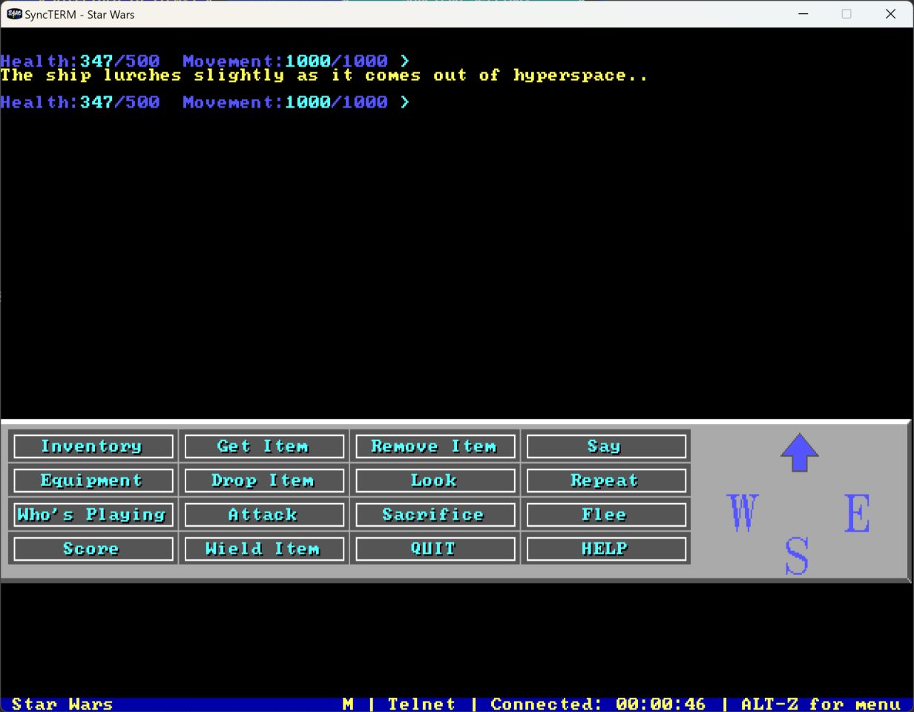
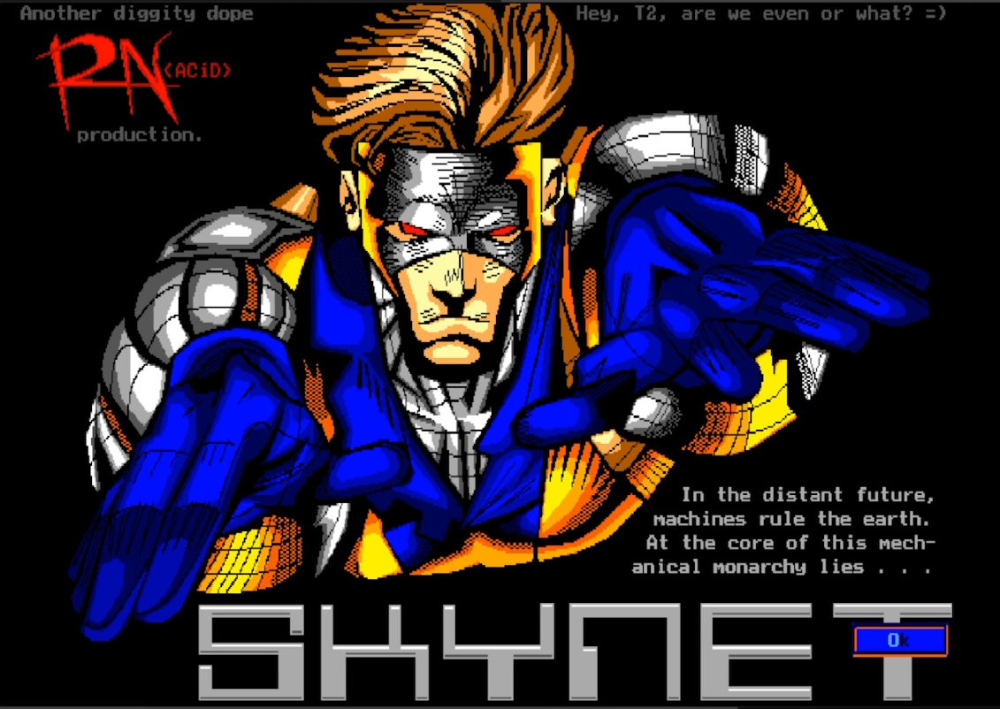

# RIPScrip "Remote Imaging Protocol" (v1.54)

:::tip[Note]
This is not really a protocol invented for MUD. Instead it was invented for bulletin board systems and *also* used in a few MUD servers. Nowadays there are no clients in use that support this protocol.
:::
**Source**: [RIPscrip v1.54 specification](RIPScrip-1.54.doc)

RIPScrip was a graphic language that allowed drawing on screen using graphics primitives. Areas could be defined as buttons, so you could create a graphical user interface using RIPscrip. The commonly used version 1.54 is restricted to a screen resolution of 640x350 pixel. Newer versions (2.0 and upwards) allowed higher resolutions and also using bitmap graphics, but those version specifications were never released to the public. 

Example from *Star Wars Galaxy Reborn*, connected via SyncTerm

Example from a BBS


## Definition

RIPscrip is a text based Script language for displaying onlinegraphics.  The script language conforms to 7-bit ASCII, avoiding the use of Extended ASCII characters.  This allows transmission over X.25 networks and other carriers that do not support full 8-bit binary transfers easily.  RIPscrip allows RIPscrip graphical statements to be mixed with printable ASCII text andANSI/VT-100 directives.  RIPscrip can dynamically determine what is graphics and what is text and display them appropriately in separate windows (a graphics window and a text window).  And if you must have your own proprietary commands, RIPscrip has room for that too.

## How does RIPscrip work?

RIPscrip uses a flexible, and very efficient script language for its graphical statements.  Its efficiency stems from its compactness and developmental planning.  It is entirely Object Oriented instead of Raster Oriented for efficient transmission of data and powerful editing capabilities (using RIPaint for example).  The language is open ended enough so that literally trillions of different graphics commands can be implemented as needed.  RIPscrip is not a proprietary protocol standard and is open to suggestion from the rest of the world.


## General Structure

This document describes RIPscrip commands up through version 1.54 of the RIPscrip Protocol Specification.

RIPscrip is organized into 10 levels of graphical commands (low Level-0 to high Level-9).  Level-0 commands are the building blocks of RIPscrip.  The basic graphics primitives of the system are all Level-0, including the commands Line, Rectangle, Circle, Color, Font, etc.  Each level of RIPscrip gets progressively higher-level in concept.  For example, Level-1 commands use Mouse Regions, Icons, and Formatted Text Regions.

The basic syntax rules are as follows:

1.  A RIPscrip command line starts at the beginning of a line of text.  A RIPscrip command line moved to the middle of a line of text is treated as literal text. This prevents people inserting mischievous things in teleconference messages, or similar pranks. The only exceptions to this rule is stated below under item 6, "continuation of long lines", and item 12 "alternate RIPscrip starting sequences".

2.  A RIPscrip command line begins with an exclamation mark (!).

3.  Every RIPscrip command is preceded by the universal RIPscrip delimiter, vertical-bar (|)

4.  Individual RIPscrip commands may be combined on the same line providing they are separated by the vertical bar delimiter.

5.  RIPscrip commands or command lines may be split across multiple lines with a backslash (\) just before each split.  This helps RIPscrip commands conform to right margins and escape word wrapping.<br/>
    An example:
    ```
    !|c02|L02030405|P0901020102010201020102\
    0102010201020102
    ```
6.  RIPscrip must allow for normal text to be intermixed with RIPscrip commands.  If unrecognized text appears after a RIPscrip command, on the same line, the text is ignored (the command is not ignored).  A line that does not begin with "!|" is considered raw text and is routed to the TTY text window (see "8" below).

7.  RIPscrip makes provisions for a Graphical Window and a Text Window.  The Graphical Window is where all RIPscrip graphics appear.  The Text Window is where raw text appears.  Raw Text includes ANSI color and cursor movement codes (a subset of VT-100 terminal emulation).

8.  The vertical bar (|) of a RIPscrip command can be followed by a level number.  If the 1st character after (|) is a numeric digit (1-9), then that's the RIPscrip Command Level.  If the very 1st character is NOT a digit 1-9, then it is the command type character and the command is a Level-0 command.  If the 1st character is a digit 1-9, and the second character is also a digit, then that defines a sub-level of a RIPscrip level.  
    For example:
    ```
      !|L     RIPscrip Level-0 Command "L"
     !|1L     RIPscrip Level-1 Command "L"
    !|15L     RIPscrip Level-1, sub-level 5 Command "L"
    ```
    Each of the above examples are unique commands not to be confused with each other.  You may continue the sub-levels up to a maximum level of 9 (e.g., !|123456789&lt;cmd&gt;").

9.  Every RIPscrip command includes a command type character.  In Level-0 commands, this character immediately follows the vertical bar.  At all other levels, it follows the level digits.  The command type character may be any printable non-decimal-digit character.

10. Following the command type character are 0 or more parameters. If the command requires a text-string, it is always the LAST parameter.  Numeric parameters DO NOT have any delimiters (commas, dashes, spaces, etc.).  A variable width numeric parameter may be used as the last parameter.  This allows for maximum efficiency.  Numbers are represented in base-36.  This compacts numbers down to roughly 3/5 of their decimal form. This numbering system, technically called "Hexa-Tri-Decimal", has affectionately been dubbed "MegaNums".  Unlike Hexadecimal which uses 0-9, A-F, MegaNums take advantage of the entire alphabet, using characters 0-9 and A-Z.

11. An exclamation mark (!) or vertical bar (|) character can appear in a RIPscrip text parameter by preceding it with a backslash(\). A literal backslash is represented with a double-backslash (\\).

12. A RIPscrip sequence CAN begin in a column other than column #0, if the exclamation mark prefix is replaced with a Ctrl-A (Start Of Header [SOH]) character, or Ctrl-B (STX) character.  Since 99.9% of all BBS' do not allow users to enter most control characters, users will be unable to begin RIPscrip sequences in the middle of a command line.  Only the host should be able to do this.  This prevents people from cluttering  teleconference, or other areas of a host with spurious RIPscrip sequences.

13. **(Added in v1.54)**<br/>
    If the last couple of bytes on a RIPscrip text line are backslashes, special care must be taken to make sure that they are not interpretted as a line-continuation.  If a literal backslash is desired as the last position on the line, it must be specified as a double-backslash (eg, "\\").  If a line- continuation is used then there would have to be three backslashes used on the line as in the following example: 
    ```                                                                  
    !|@2233this is a text line with a literal \\\
    used in the message 
    ```
    This would text output at (22,33) [meganum] the message:
    ``this is a text line with a literal \used in the message``

## ANSI Sequences (Auto Sensing)

RIPscrip predominantly uses non-ANSI command sequences.  In a couple of situations though, an ANSI sequence is allowed to perform a specific function. There are currently three separate ANSI sequences defined in the RIPscrip protocol to perform various actions.  They are as follows:

| ANSI   | Meaning                                                      |
| ------ | ------------------------------------------------------------ |
| ESC[!  | Query RIPscrip version number. (Since V1.54)<br />RIPterm will respond with ``RIPSCRIPxxyyvs`` where "xx" is equal to the major version number (zero padded), "yy" is equal to the minor version number (zero padded), "v" is the vendor code of the terminal program (see below), and "s" is the vendor's sub-version code for their software.  For v1.54, the returned sequence for RIPterm (Vendor Code "1") would be ``RIPSCRIP015410``.<br/>Another example, v1.23 with a Vendor Code of "2" and a sub-revision code of "5" would return ``RIPSCRIP012325``.<br/>Valid Vendor Codes are:<br/>* 0: Generic RIPscrip terminal (vendor unknown) <br />* 1: RIPterm<br />* 2: Qmodem Pro |
| ESC[0! | Same as ESC [ ! (see above)                                  |
| ESC[1! | Disables all RIPscrip processing.  Any RIPscrip sequences are interpreted as raw text. |
| ESC[2! | Enabled RIPscrip processing.  Any RIPscrip sequences will be parsed and processed. |


For detailed information on command sequences consult the [RIPscrip v1.54 specification](RIPScrip-1.54.doc)