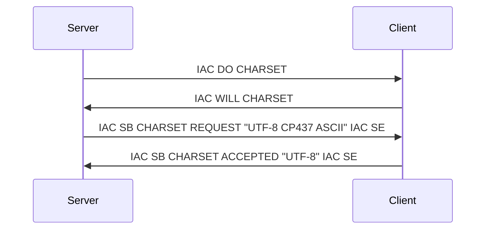

# Telnet Charset Option (CHARSET)

**Option code:** 42

**See also**: [RFC 2066](https://www.rfc-editor.org/rfc/rfc2066.html)

Early versions of Telnet assumed that ASCII charset is in use. This telnet option allowed switching to a different charset.

[RFC 5198](https://www.rfc-editor.org/rfc/rfc5198) introduces a default of UTF-8 for new protocols going forward,
but notes in Appendix D that further work on a new telnet option would be needed to retrofit this to telnet, and does
not change existing protocols.

| Tokens         | Bytes      | Meaning                                           |
| -------------- | ---------- | ------------------------------------------------- |
| IAC WILL NAWS  | 255 251 31 | Client: I can negotiate charsets                  |
| IAC WONT NAWS  | 255 252 31 | Client: I won't negotiate charsets                |
| IAC DO   NAWS  | 255 253 31 | Server: Hey client, let's negotiate charsets      |
| IAC DONT NAWS  | 255 254 31 | Server: Sorry, I cannot negotiate charsets        |

## Handshake plus initial message

:::info
The charset can also be sent as a [MNES](../mud/mnes) variable
:::
