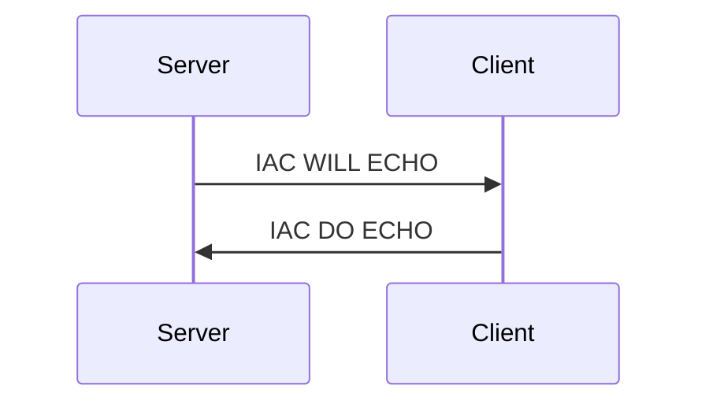
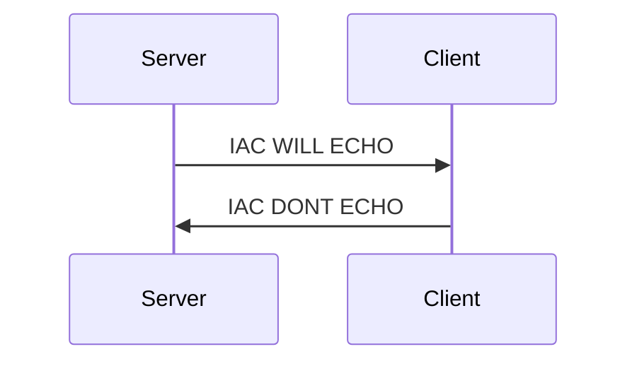
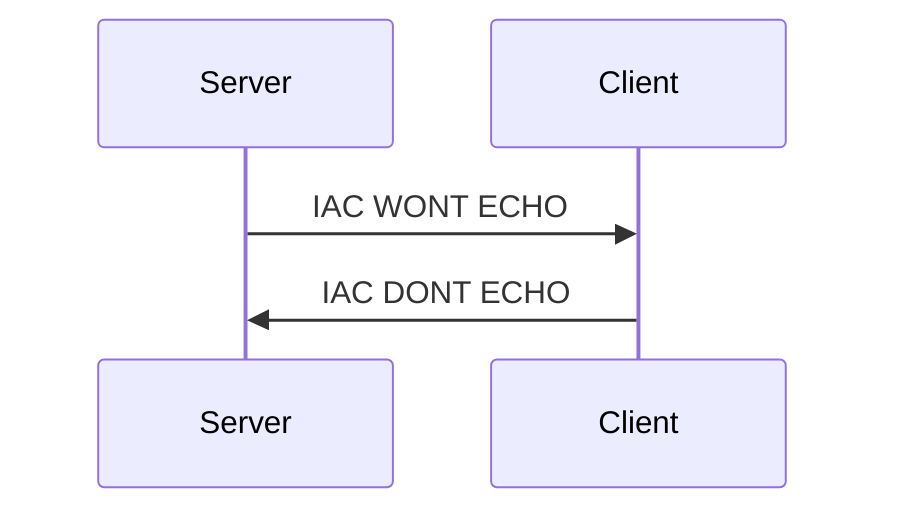

# ECHO

**Option code:** 1

**See also**: [RFC 857](https://www.rfc-editor.org/rfc/rfc857.html)

In a telnet connection both parties could theoretically echo the typed input 
by the user. If the client does that, it is called a **local echo**. If the
server does that, it is called **remote echo**.

By default no echo is transmitted via Telnet, meaning that it is the job of 
the client to generate a local echo. This Telnet option exists to negotiate 
which party generates the echo.

When the server wants to gain control over the echo, it does that by 
promising the client that it ``WILL`` take care of the echo - which also means 
that the client should stop generating local echo. This is often used in
situations (e.g. password input) where you don't want any echo at all. 
If the server wants the client to create local echo again, it informs the
client that it ``WONT`` send echo anymore.

Telnet clients answer the WILL/WONT commands with either DO or DONT responses.

| Tokens         | Bytes     | Meaning                                           |
| -------------- | --------- | ------------------------------------------------- |
| IAC WILL ECHO  | 255 251 1 | Server: The client should not generate a local echo. |
| IAC WON'T ECHO | 255 252 1 | Server: The client should generate a local echo.     |
| IAC DO ECHO    | 255 253 1 | Client: Confirms/Expects the server to send rempte echo    |
| IAC DON'T ECHO | 255 254 1 | Client: Confirms that it will generate local echo   |

:::note
Usually only the server side is actively controlling the echo generation, but the telnet option itself makes no assumption on the directions in which echoing makes sense.
:::

## Examples

Server wants client to stop creating local echo, client confirms

Client does not understand the ECHO telnet option

Server wants client return to generating local echo, client confirms

## Interworking with SGA

When the (remote) ECHO is enabled **and** the [SGA](sga) telnet option is enabled too,
some MUD clients interprete this setup as the request not even to do local 
line buffering and send every keystroke via telnet. This *character-a-time-mode*.
is some kind of best practice, but not supported by all clients

