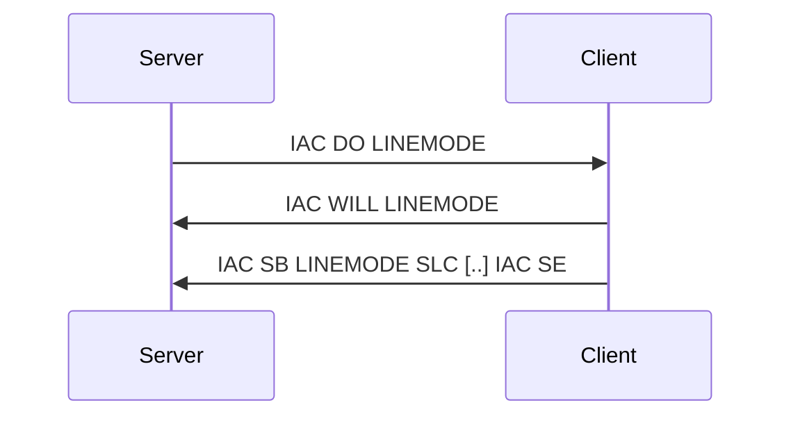
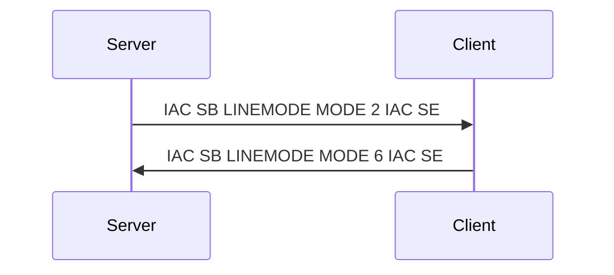
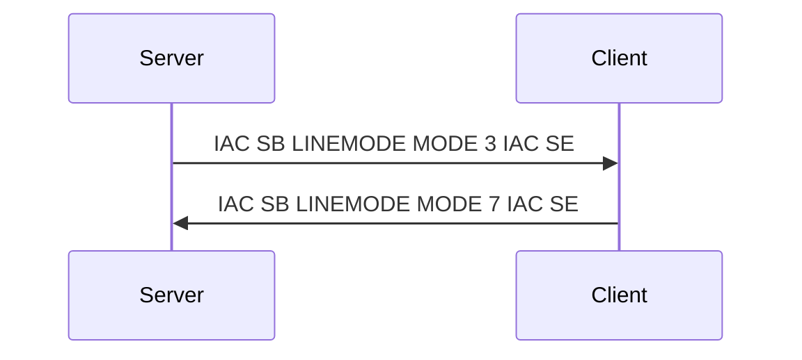

# Telnet Linemode Option

**Option code:** 34

**See also**: [RFC 1184](https://www.rfc-editor.org/rfc/rfc1184.html)

The default behavior of a telnet connection is that user input is processed 
(e.g. deleting a char or inserting at a different position) locally and sent 
when the ENTER key has been hit. Effectively the client only send complete 
input lines, which is why this is called **line mode**

Some applications may require tighter control or want to get immediately 
informed on keystrokes. This RFC allows finetuning how clients process user
input.

:::warning
It is very rare that this RFC is supported by clients. Usually only pure
telnet clients implement it.
:::

## Handshake
The server demands (WILL) to enable the LINEMODE feature. If the client supports that, it answers
with DO, followed by a subnegotiation that informs the server about its capabilities.

This informational subnegotiation can get quite long.
:::note
You can usually ignose that information. Skip over it if you are not interested.
:::

```
IAC SB LINEMODE SLC 
  1   0    0 
  3  98    3 
  4   2   15 
  5   0    0 
  7  98   28 
  8   2    4 
  9  66   26 
 10   2  127 
 11   2   21 
 12   2   23 
 13   2   18 
 14   2   22 
 15   2   17 
 16   2   19 
 17   0    0 
 18   0    0
```
which translates to:
- Operation SYNCH is not supported 
- Operation IP is supported and uses character 0x3 - which can be changed - [VALUE, FLUSH_IN, FLUSH_OUT]
- Operation AO is supported and uses character 0xf - which can be changed - [VALUE]
- Operation AYT is not supported 
- Operation ABORT is supported and uses character 0x1c - which can be changed - [VALUE, FLUSH_IN, FLUSH_OUT]
- Operation EOF is supported and uses character 0x4 - which can be changed - [VALUE]
- Operation SUSP is supported and uses character 0x1a - which can be changed - [VALUE, FLUSH_IN]
- Operation EC is supported and uses character 0x7f - which can be changed - [VALUE]
- Operation EL is supported and uses character 0x15 - which can be changed - [VALUE]
- Operation EW is supported and uses character 0x17 - which can be changed - [VALUE]
- Operation RP is supported and uses character 0x12 - which can be changed - [VALUE]
- Operation LNEXT is supported and uses character 0x16 - which can be changed - [VALUE]
- Operation XON is supported and uses character 0x11 - which can be changed - [VALUE]
- Operation XOFF is supported and uses character 0x13 - which can be changed - [VALUE]
- Operation FORW1 is not supported 
- Operation FORW2 is not supported 

To translate that even further, it means
- If someone presses CTRL-C, the client does not send a Telnet *Interrrupt Process* (IP), but an ASCII 0x03 (ETX)
- Instead of an Telnet  *AO Abort Output* an ASCII 0xf (SI) is sent.
- Instead of ``IAC ABORT`` (255 238) the ASCII control code 0x1C (FS File Seperator) is sent
- Instead of ``IAC EOF`` (255 236) the ASCII control code 0x4 (EOT End of Transmission) is sent
- Instead of ``IAC SUSP`` (255 237) the ASCII control code 0x1a (SUB - Substitute) is sent
- and so on. Also if you want, to can reconfigure each setting.

## Entering character-a-time mode
With the **MODE** command, the server can control the client behaviour. It does that by sending a bitvector for the following data

| FLAG      |  Value  |   Meaning  |
| --------- | ------- | -----------|
| EDIT      |    0    | Character-a-time mode |
|           |    1    | Line mode  |
| TRAPSIG   |    0    | Send signals as ASCII values |
|           |    2    | Send signals as Telnet equivalents |
| MODE_ACK  |    4    | This is an ACK for the previous command |
| SOFT_TAB  |    0    | TAB should be send as ASCII 0x9 |
|           |    8    | TAB should be expanded into spaces |
| LIT_ECHO  |    0    | Non-printable characters can be treated at will |
|           |   16    | Show Non-printable characters as literals | 

So, if you want to enable *character-a-time mode*, the EDIT bit must not be set.

Example: Clearing EDIT (and other) and setting TRAPSIG flag


## Switching back to line mode
Example: Setting EDIT and TRAPSIG flag



## What else
If you are willing to experiment a bit further, you can have a look at the FORWARDMASK command. In normal linemode that client flushes its input buffer when the ENTER key is pressed - this can be changed.
The FORWARDMASK gets a 32 octet (16, if your telnet connection does not transmit binary) parameter, resulting in a 256 (or 128) bit vector. Each bit in this vector represents an ASCII code that should flush the input buffer.

