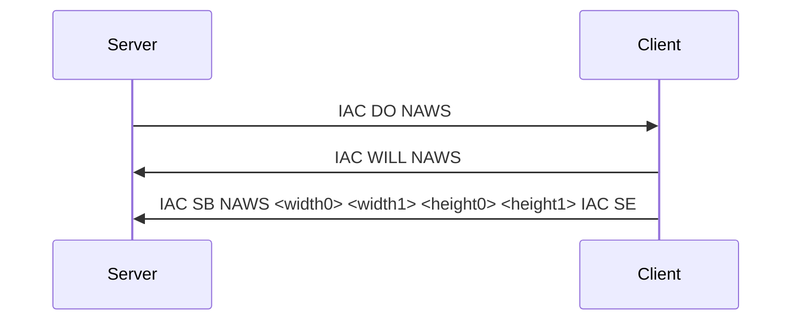

# Negotiate About Window Size (NAWS)

**Option code:** 31

**See also**: [RFC 1073](https://www.rfc-editor.org/rfc/rfc1073.html)

When enabled, this Telnet option requests that the client immediately sends a telnet subnegotiation containing the current screen size (in characters) and later on every time the size changes. 
Usually it is the server that sends a ``IAC DO NAWS`` to toggle that behavior.

| Tokens         | Bytes      | Meaning                                           |
| -------------- | ---------- | ------------------------------------------------- |
| IAC WILL NAWS  | 255 251 31 | Client: I will/would like to send NAWS messages   |
| IAC WONT NAWS  | 255 252 31 | Client: I won't send NAWS messages                |
| IAC DO   NAWS  | 255 253 31 | Server: Hey client, please send NAWS messages     |
| IAC DONT NAWS  | 255 254 31 | Server: Hey client, please stop doing NAWS        |

## Handshake plus initial message

*Height* and *Width* are 16 bit values, requiring 2 octets each.
Any occurrence of a value of 255 must be doubled