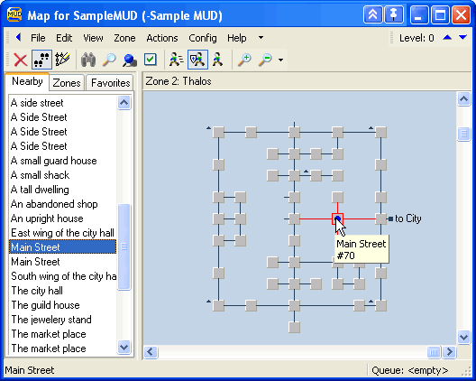

# So you want to write a mapper ...

This article is intended for client and server developers who want a nice automap experience for players.

## Graph Maps

Having a map to aid orientation is a feature that enhances the players experience. The majority of MU*s has a world that consists of "rooms" that are connected to other rooms - together such a world forms a graph. Displaying such a graph map is one of the premium features of a MUD client - here is one example of one of the first mappers ever (in zMUD)

 

### Detecting rooms and exits

MUD server code bases written before the 2000's typically did not provide in-game maps.  Players who wanted maps were expected to draw them by hand, as was common practice with other single player text adventure games at the time.   As MUD worlds began to grow beyond the size of the smaller text adventures that preceded them, maintaining a set of hand drawn maps became more of a burden.   Some of the earliest dedicated MUD clients were developed with features to aid players with making their own maps.

#### 1. **Detect the output format of new rooms and learn commands**<br/>
   Often a room name begins directly on the start of a line ... maybe it is underlined or bold ... maybe some brackets follow. 

   For exists the client may recognize a typed command as a direction to move, but it is just guessing that a typed `n` means `north` - and let's not think about `in` or `clockwise` as directions.
   As you can see, this is all quite vague and highly dependent on the MUD in question.  This lead to the following feature

#### 2. **MSDP**<br/>
   The [MSDP](../mud/msdp) protocol was introduced in 2009 and allows a MUD to send structured data to the client.  It is a simple key-value protocol, where the server can send a list of variables and their values. 
   There are two approaches to transmit room information via MSDP. The first one is to send the room information as a single MSDP variable, like this:
   ```
   "AREA_NAME"            Current room's area name.
   "ROOM_EXITS"           Current room's exits in array format, preferably using n e s w u d nw ne se sw notation.
   "ROOM_COORDINATES"     Current room's coordinates in array format, preferably using the x y z order.
   "ROOM_NAME"            Current room's name.
   "ROOM_VNUM"            Current room's virtual number, or a unique identifier if a vnum is unavailable.
   ```
 
   The second and recommended approach (since 2011) is to use the room table
   ```
   "ROOM"
     "VNUM"               A number uniquely identifying the room.
     "NAME"               The name of the room.
     "AREA"               The area the room is in.
     "COORDS"              (optional)
       "X"                The X coordinate of the room.
       "Y"                The Y coordinate of the room.
       "Z"                The Z coordinate of the room.
     "TERRAIN"            The terrain type of the room. Forest, Ocean, etc.
     "EXITS"              Nested abbreviated exit directions and corresponding destination VNUMs.
   ```

#### 3. **MXP tags**<br/>
   When [MXP](../mud/mxp) v0.3 was introduced, it defined 3 [line-tags](../mud/mxp#mxp-line-tags) that could tell a client what part of the output was *a room name* or a *room description* or an *exit*.  At that time this was THE way to ensure a good mapping experience in zMUD.
   It still had some issues, for example when the room name was not unique and maybe the room description changing over time. Also not all MUDs were able to implement MXP or deal with opening and closing ANSI control sequences. This finally lead to

#### 4. **GMCP `room.info`**<br/>
   Among the first packages defined for GMCP was the [`room`](../gmcp/room) package. It was used to send a GMCP event that roughly looks like this:
   
   ```json
   room.info {
       "num": 12345
       "name": "Barren hills",
       "exits:" {
         "e": 12346,
         "w": 12344
       },
       ... plus more game dependent information ...
   }
   ```
   
   >:::warning
   >
   > The original spec only assumed numerical room identifiers - nowadays these are often just strings. If you do an implementation, better expect strings.
   
   >:::warning
   >
   > Some MUDs do not send any room identifiers (or placeholders) - sometimes this happens just for maze zones, sometimes in general.
   
   >:::info
   >
   > Directions are not only the cardinal directions, but also include up/down, in/out, clockwise/counter-clockwise and more. The direction names are not standardized, so a mapper should be able to handle synonyms.
   
   The additional fields and their names vary from server to server, but 
   GMCP is still the most reliable way to detect rooms and exits. It is also the only way to detect rooms that are not unique by name or description. If you are writing a mapper, you should support GMCP.

4. **GMCP `mudstd.room.info`**<br/>
   The [`mudstd.room`](../gmcp/mudstandards_room) package is a more recent attempt to standardize the room information sent via GMCP. It defines a set of mandatory and optional fields, including unique identifiers, names, descriptions, terrain types, and exits. This standardization allows for better interoperability between different MUDs and clients.
   
   It operates similarly to the original `room.info` event, but with a clear definition whether an attribute is mandatory or optional and if what datatypes or values are expected.
   
   As of today, the `mudstd.room` package is still a proposal and request for comments and not yet adopted.
   
   
So, there are three telnet options that define a way to transmit room information to a client: MXP, MSDP and GMCP.
While MXP is likely the most widely supported option (see graph below), it isn't known if servers make use of the output tagging at all.
Between GMCP and MSDP, GMCP is more widely supported - but there are still a lot of MUDs that only support MSDP.


(Source: https://muds.modem.xyz/statistics.html#telnet-option-negotiation )
   
### Positioning rooms

Knowing that a room is west of another may not be the only problem. Consider this room layout:

```
A - B - C - D
|       |   |
|       E - F
|           |
G --------- H
```

and now assume a player is starting at H and walking clockwise - it will challenge the mapper's layout algorithm. 

To help with the layout of the nodes of the map, *some* MUDs include map coordinates in the `room.info`:

```json
room.info { 
    "num": "room_1", 
    "name": "At the entrance of the park", 
    "exits": { 
        "e": "room_2", 
        "s": "room_3", 
        "w": "room_4" 
    }, 
    "coord": { 
        "x": 37, 
        "y": 19, 
        "z": 0 
    } 
}
```

But again: The `coord` attribute is optional. Sometimes - seen for zones where the server does not want the zone to be mappable - the coordinates are sent, but empty or -1.

### Transmitting a full zone graph-map

If a server wants to be really helpful for mappers, it can transmit information about the complete zone.  Again the `room.info` event can contain a special attribute called `map`, which contains an URL to a map file in the [MMP](../MMP_Specification) file format.

```json
Room.Info {
    "num": "12345", 
    "name": "On a hill", 
    "map": "www.imperian.com/itex/maps/clientmap.php?map=45&level=3 5 4", 
    "exits": { 
        "n": "12344", 
        "se": "12336" 
    }, 
 }
```

MMP is an invention by the IRE worlds and an XML based format. It roughly looks like this

```xml
<?xml version="1.0"?>
<map>
    <areas>..</areas>
    <rooms>
      <room id="8463" area="1" title="Aryana's Spring" environment="8">
        <coord x="0" y="0" z="0" />
        <exit direction="north" target="8472" />
        <exit direction="east" target="8458" />
        <exit direction="south" target="8453" />
        <exit direction="west" target="8465" />
        <exit direction="down" target="8558" />
        <exit direction="in" target="17200" />
      </room>
        ...
    </rooms>
    <environments>..</environments>
</map>
```
When a MUD supports at least coordinates in `room.info`, building your map should be easy. Along with MMP files, you should be able to present a user a map before he started exploring a zone ... which may take the fun out of the game, so be careful.

#### MMP minimaps

There is no guarantee that the URL of the MMP file is the full map - it may as well be a partial map just depicting the area the player is able to perceive, with relative coordinates to the players position.

### Styling room nodes

It is a helpful feature if the room node itself when rendered shows additional information, like the terrain - a "forest" room may be colored in dark green, the "meadow" in light green, a "path" in brown or a "road" in grey.

The `room.info` often has either a `terrain` or `environment` attribute (depending on the MUD) that contains a single keyword. 

```json
room.info { 
    "num": 5922, 
    "name": "At the entrance of the park", 
    "terrain": "city", 
    ...
}
```

Since we do have a lot of different genres for games out there, there is no such thing as a common understanding what terrains exist. Your options here are:

#### 1. Styling in MMP

MMP itself can contain a list of `<environment>`. Each environment has a numeric identifier (which is used in `room.info` -> `enviroment`), a display name and a color code (referring to 16 ANSI colors)

```xml
<environments>
   <environment id="1" name="Dark Forest" color="2" />
   <environment id="2" name="Constructed underground" color="3" />
   ...
</environments>
```

#### 2. Styling with `mudstd.room`

The rather new MUD Standards package `mudstd.room` defines a [`mudstd.room.terrain`](../gmcp/mudstandards_room#mudstdroomterrain) event that can be sent to the client. It contains a list of terrain definitions, each with an internal identifier, a display name and optionally an RGB color code and (optional) an URL to a small image tile. URLs may also be data-urls of the image itself.

```json
mudstd.room.terrain {
    {
        "id": "city",
        "label": "City",
        "color": "C0C0C0",
        "tile_url": "data:image/jpeg;base64,/9j/4AAQSkZJRgABAgAAZABkAAD"
    },  {
        "id": "forest",
        "label": "Forest",
        "color": "0000FF",
        "tile_url": "https://myserver/tiles/forest.jpg"
    }
}
```

Using this event, a MUD can send its custom terrain list, suggested coloring and even small tiles representing the terrain.

:::info
While it would be possible to transmit full tilemaps this way, it is not recommended. A client using this package is not required to make use of those tiles.
:::

#### 3. Custom terrain files

Terrain definitions usually don't change very often - this allows the different approach of offline terrain definition files that are understood by a client.

For example [MUDForge](https://play.mudvault.org/), the webclient of MUDVault, supports user-uploaded terrain packs, which are simple JSON files.

```json
{
  "name": "Void of Reality Terrain Pack",
  "description": "Official terrain styles for Void of Reality MUD",
  "terrainStyles": [
    {
      "name": "inside",
      "color": "#3e2723"
    },
    {
      "name": "city",
      "color": "#ffffff"
    },
    {
      "name": "field",
      "color": "#1b5e20",
      "image": "data:image/png;base64,iVBORw0KGgoAAAANS..."
    },
    {
      "name": "forest",
      "color": "#228b22"
    },
  ...
 }
```

### Inline maps

Of course there is always the option that the server itself renders the surrounding as some kind of minimap directly next to the room description text.

### Words of Warning

This list is far from complete, but worth considering when you build a graph-mapper:

* Not all MUDs provide GMCP or MXP room information - you may need to rely on parsing the output of the room description and exits.
* Some MUDs purposely do not provide unique room identifiers, to prevent mapping.
* There are more exit directions than just the cardinal directions.
* There is no gurantee that exits are bidrectional - some MUDs have one-way exits. Or even if there is an exit in the opposite direction, it might lead to a different room.
* It may be "ethical" to only uncover rooms of a map, that a player has actually visited - but some MUDs provide full maps of a zone, which may take the fun out of exploring.

## Tilemaps

Instead of having the client do the mapping and rendering, some servers to provide tilemaps, which means there is a 2D grid with symbols for each grid position. 

Often these maps are meant to be updated in realtime, like when a mobile passes through you see it step from tile to tile - or even the illumination a fireball provides when it is hurled at a target.

Different ideas exist for this purpose.

### 1. `gmcp.overland` package

[`gmcp.overland.map](../gmcp/gmcp_overland) is an event unique to the MUD  "Lumen et Umbra".  It basically consists of a rows of ANSI codes and ASCII symbols

```json
gmcp.overland.map {
    "r1" : "\033[38;2;0;0;0m     \033[38;2;111;94;84m...",
    "r2" : "..."
    ..
    "r11": "...",
    "size": 12
}
```
The advantage of this format is that you can transmit a full map, but also just the rows that have changed since the last update. 

### 2. `mudstd.tilemap` package

This GMCP package is meant to send graphical layered tilemaps to a client.

#### On connection

This GMCP package bases on the idea that all tiles are defined in spritesheets. On connect, a MUD sends the client a list of used spritesheets. Each tileset gets a unique identifier, a download URL for the sprite sheet and information about the size of each tile.

```json
mudstd.tilemap.tilesets {
    "mobs":{
        "url":"http://prelle.selfhost.eu:4080/symbols/Steam Arcana Mobs.png",
        "sizeX":32,
        "sizeY":32,
    },
    ...
```

#### When entering an area

When entering the game and eventually later when entering a new zone, the server informs the client how transmitted maps will be constructed. This includes the expected size to render each tile, how many tiles a map is wide and high and which tileset will occupy a specific number range.

```json
mudstd.tilemap.info {
    "tileWidth":32,
    "tileHeight":32,
    "mapWidth":11,
    "mapHeight":11,
    "range":{
        "1":"terrain",
        "257":"immobiles",
        "513":"assets",
        "621":"mobs"
    }
}
```

In the example above, a tile number 400 would be in the "immobiles" tileset (which ranges from 257 to 512) - which makes it the 144th tile in that set.

#### Map updates

The server sends frequent updates like this (for an 11x11 map):

```json
mudstd.tilemap.update {
    "data":[
        [
            [],[],[],[],[],[],[],[],[],[],[]
        ],[
            [],[],[],[],[],[],[],[],[],[],[]
        ],[
            [],[],[119],[119],[119],[10,308],[119],[119],[119],[119],[119]
        ],[
            [],[],[119],[10],[10],[10],[10,641],[10],[119],[10,534],[10,535]
        ],[
            [],[],[119],[10,536],[10],[10],[10,539,556],[10,540],[119],[10],[10]
        ],[
          ...
```

Empty arrays indicate nothing to render (or black background). An array with a single number is a single tile to render. If the array contains multiple numbers , they are meant to be rendered at the same position in that order. (Some tiles have transparent background, so they can stack)

There currently is no brightness information e.g. to model light sources at night - this is yet to come.

### 3 Inline graphics

Several standards exist to transmit inline images. A map can be pre-rendered by the server and transmitted to the client. 

* [VT300 series Sixel](https://en.wikipedia.org/wiki/Sixel)
  An old terminal standard that allowed sending pixel graphics to be rendered in character cells. Has restrictions on how many colors can be rendered per character cell. Rarely adopted.

* **Kitty Graphics Protocol**

  A modern terminal standard that allows sending modern image formats an special ANSI sequences. When fully implemented, it even supports animated images. Adopted in state-of-the-art terminal emulators, like Kitty, Ghostty ...

* **ITerm's Image Protocol**

  Like Kitty a modern terminal standard for inline images in ANSI sequences. Does not support animation. Adopted in state-of-the-art terminal emulators like ITerm, WezTerm and xterm.js (for web apps)

* MXP `<image>`

  An advanced feature of MXP was the ability to [transmit an image url](../mud/mxp#images) to the client for line rendering.
  Usually images are always rendered as the only content in a row - there is no text left or right of it. Though this is not a requirement, most client with MXP support don't support cursor positioning to decide *where* to display the image or text.

* Pueblo ``

  Modeled after the HTML `img`-tag
