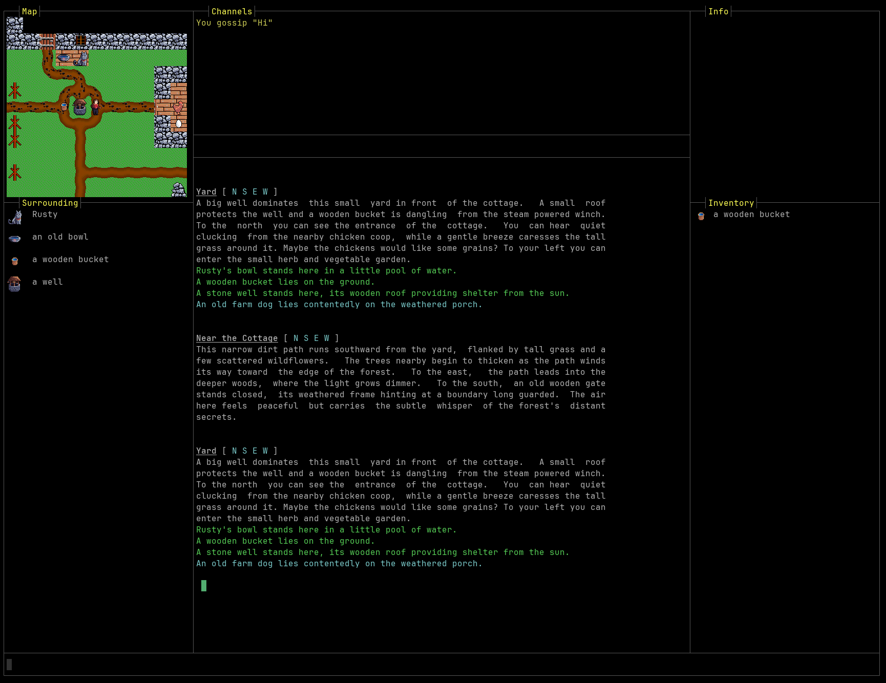

# Server-controlled User Interfaces

We are used to MU* servers just sending ANSI styled text output, which the clients displays in a scrollable area. Depending on the client or plugins in the client that user interface is enriched by additional areas where more information are presented - e.g. the vitals, the automap ...
What exactly a user gets to see, is outside of the servers control. But there are also options to allow a server to control what a user sees.

## 1. Full VT100 support

The early days of computing defined terminals as just being a device that receives instructions what to display. This also includes commands to move the cursor anywhere on the output screen, clear the screen or just parts of it and defines scrollable areas.



All it requires on the client-side is 

* a capable terminal emulator component 
* also handling the return channel from the terminal to the server
* and ideally support for character-a-time mode

Clients that support right now are Linux Telnet, Sip and Lociterm.

On the server side, you must implement a detection phase, where you send commands and queries to the terminal and learn from the responses what features the terminal supports. For example all terminals support defining top and bottom scrolling margins, but only few also support left and right margins.

After your server is aware of the terminal capabilities, the terminal is your canvas. The site [VT100.net](https://www.vt100.net/docs/vt220-rm/contents.html) is a good source for documentation.

:::warning
Special care must be taken to still allow client side triggers. It is recommended that the regular game output never includes cursor positioning commands and also to continue use the normal scroll area.

When in character-a-time mode, the client isn't any longer aware of what exactly the server assumes as typed command. The server echoes all input characters live, but it may send data to other areas of the terminal. This will lead to local client aliases no longer working, since the arrive at the server first. But a lot of server also support server-side aliases, so this can be worked around.

:::

:::note
Maybe it would be a good idea to define a way for client and server to exchange lists of aliases.
:::

## 2. MXP Frames

A feature of the [MXP](../mud/mxp) protocol is the ability to [split off areas from the terminal window](../mud/mxp#frames) and direct output to such a frame. E.g. you can decide that the left 30% of your client window is a frame and give that frame an identifier. You can switch where to send output by another MXP command.

```xml
<FRAME Name="Map" action="open" width="30%" left="0" internal />
<DEST Map>This appears in the map area</DEST>
This appears in the main area.
```

Frames can be `internal` (meaning: they split off from the main terminal area) or not, in which case they are to be opened as dedicated windows.

You can subdivide frames further, by sending `<FRAME>` commands after sending a `<DEST>` command.

```xml
<FRAME Name="Left" action="open" left="0" width="30%" internal />
<DEST Left>
  <FRAME Name="TopLeft" action="open" Top="0" Height="20c" internal />
</DEST>
```

In theory you can combine MXP frames with cursor positioning.

```xml
<DEST Status X=10 Y=2>100</DEST>
```

"in theory", because it is unknown if this is supported outside zMud or cMud clients.

## 3. WebViews

A feature originally introduced by the *BeipMu* client is a GMCP package [`webview`](../gmcp/webview).  It basically allows either opening new windows or splitting off areas of the terminal window to open a HTML URL. The page it loads is expected to contain Javascript that needs to be executed.

```json
webview.open { "id":"minimap", "dock":"right", "url":"https://mygame.net/minimap.html", "http-request-headers":{ "name1":"value1", "name2":"value2" } }
```

Communication between server and that webview happens via GMCP.  The client is expected to provide a DOM object that scripts in the webview can access - its path is derived from the windows webview used in BeipMu:

```
window.chrome.webview.hostObjects.client
```

```javascript
const client=window.chrome.webview.hostObjects.client;
client.SetOnGMCP("mypackage",OnGMCP);

client.SendGMCP("Core.Supports.Add ","[mypackage]");

function OnGMCP(pkg, json) {
    if (pkg === "mypackage.event") {
        ...
    }
}
```

The `SetOnGMCP` command registers an event handler for all messages from a specific package. The script can announce the support for an additional GMCP package by sending the standardized `core.supports.add` method, so the server knows the initialization has happened.

From here you can do a lot what usually is reserved for full webclients. 

All in all this is comparable to installing a custom plugin on the client - at least for clients that support opening web pages. This brings us to

## 4. Automatic Plugin Installation

The concept here is that the server has dedicated support for specific clients and once such a client connects and identifies itself (via GMCP [`core.hello`](../gmcp/core_hello)).

There is no agreed upon standard how the server can instruct the client to install or update a plugin. Currently only *Mudlet* documented such a GMCP command in the `client` package:

```json
Client.GUI {
  "version": "39",
  "url": "http://www.stickmud.com/mudwww/StickMUD.mpackage"
}
```

:::note
There is no standard language to write plugins that applies to all clients. As long as that is the case, this approach is limited to specific clients and their plugin languages.
It is recommended that each client defines its own GMCP package with the clientname in as a subpackage, like `client.mudlet` or `client.mushclient` . 
:::

## 5. GMCP `mudstd.frame`

This is by and large a mixture of MXP frames and GMCP `webview`. Where MXP `<frame>` provides terminal windows and GMCP `webview` provides web pages, GMCP [`mudstd.frame`](../gmcp/mudstandards_frame) aims to be more versatile with a minimal amount of capability exchange.

The following are just command example - you can find the full specification [here](../gmcp/mudstandards_frame).

Upon connection, a client supporting this package sends a GMCP command like this:

```json
mudstd.frame.support {
    "type": {"docked","external"},
    "content": {"terminal","image"}
}
```

The command above informs the server that the client can have split off areas inside the client ("docked") or open "external" windows. The content of such an area can either be a new "terminal" or a single "image".

The server than [opens](../gmcp/mudstandards_frame#mudstdframeopen) a new frame like this:

```json
mudstd.frame.open {
    "id"  : <string>,
    "type": <frame type>, 
    "content": <content type>,
    "align": [top|bottom|left|right],
    "label": <string>,
    "parent": <string>,
    "sizeValue": <string>,
    "sizeUnit": <string>,
    "url" : <string>
}
```

Webview frames operate like the GMCP `webview` package and don't require more updates. Terminal or Image frames can get data pushed:

```json
mudstd.frame.terminal { 
    "id":   "stats",
    "clear" :   true,
    "ansi" :    "\x1b[0;1;37mSTR:\X1b[0m 12"    
}
```

```json
mudstd.frame.image { 
    "id":   "topleft",
    "image" :   "base64:<base64data>"    
}
mudstd.frame.image { 
    "id":   "topleft",
    "image" :   "http://myserver.com/portrait.png"    
}
```

:::warning​

This GMCP package hasn't been implemented by neither clients nor servers yet - it is a proposal that awaits a reference implementation.

:::
